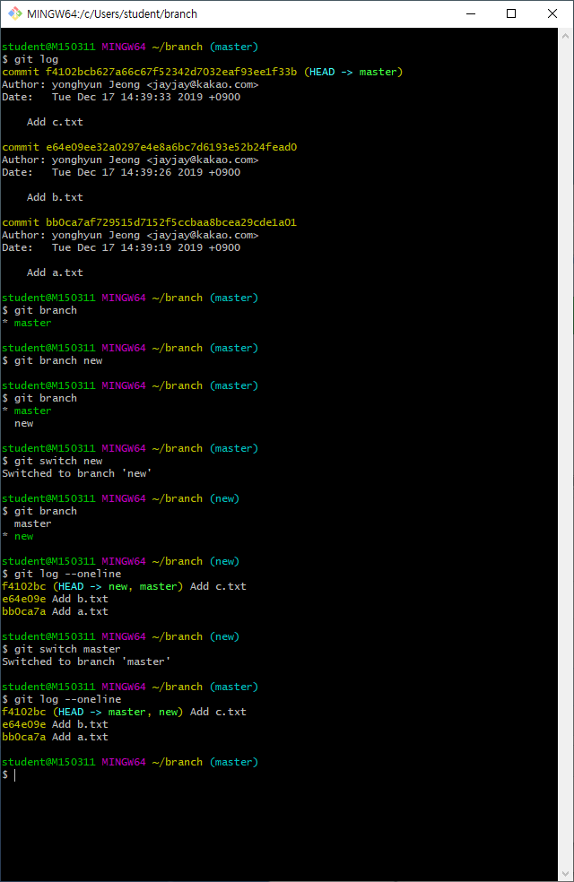
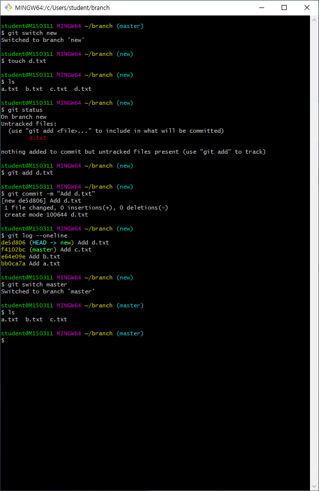
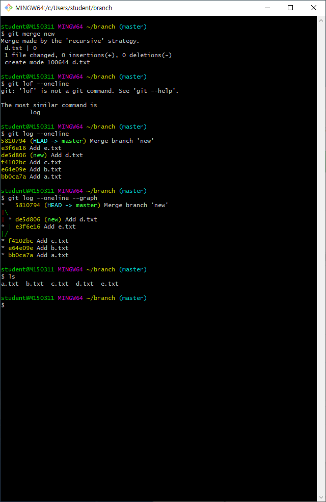
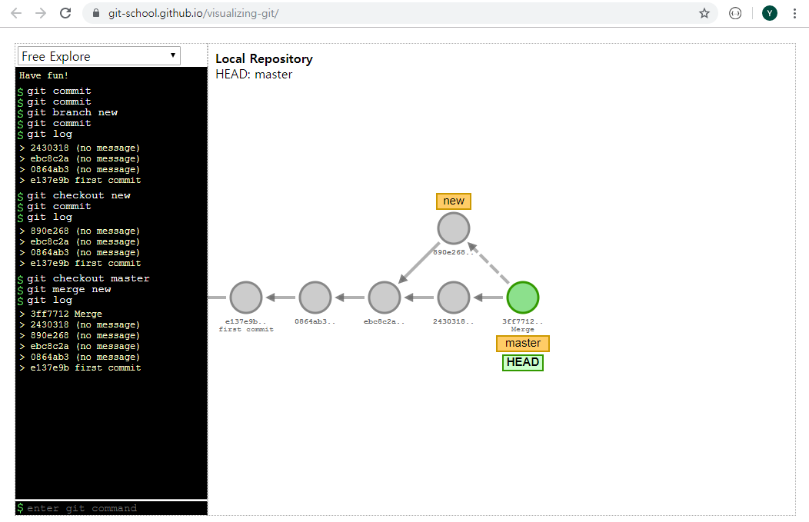

# branch

### 1. branch 생성

branch 목록 확인

``` shell
$ git branch
```
new 이름의 branch 생성
``` shell
$ git branch new
```
new branch로 (head 포인터) 이동
``` shell
$ git switch new
	... or...
$ git checkout new
```
master branch로 (head 포인터) 이동
``` shell
$ git switch master
```

new branch 생성과 동시에 포인터 이동

``` shell
$ git switch -c new
```





### 2. branch 에서 작업

``` shell
$ git switch new

$ touch d.txt

$ git add d.txt

$ git commit -m "Add d.txt"

$ git log --oneline
```





### 3. merge

merge 할 곳으로 이동 후 merge 명령어

``` shell
$ git merge new
```

메시지 에디터 뜨면 `ESC` 3번 + `:wq`






### 4. branch 삭제 (merge 후)

``` shell
$ git branch -d new
```

