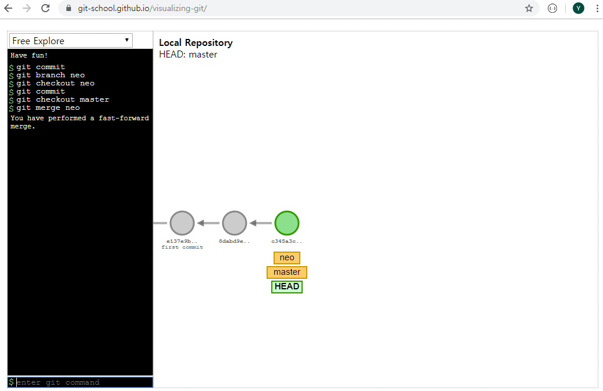

# merge

### 1. fasr-forward merge

branch 분기가 일어났지만, merge 시점에 branch 한쪽에만 commit 들이 쌓여있는 경우





> 만약 위 상황에서 branch 를 살리려면
>
> ``` shell
> $ git merge new --no-ff
> ```
>
> 


### 2. Auto-merge

merge 시점에 양쪽 branch 에 commit 들이 쌓여 있지만, conflict 가 발생하지 않는 경우


### 3. Conflict merge

merge 시점에 양쪽 branch 에 commit 들이 쌓여 있지만, conflict 가 발생하는 경우

- 같은 파일 내에 같은 상충하는 내용이 있을 경우


HEAD / ==== / NEW 라인 제거 후, 해당 부분 수정 및 저장

`add` 및 `commit` again

