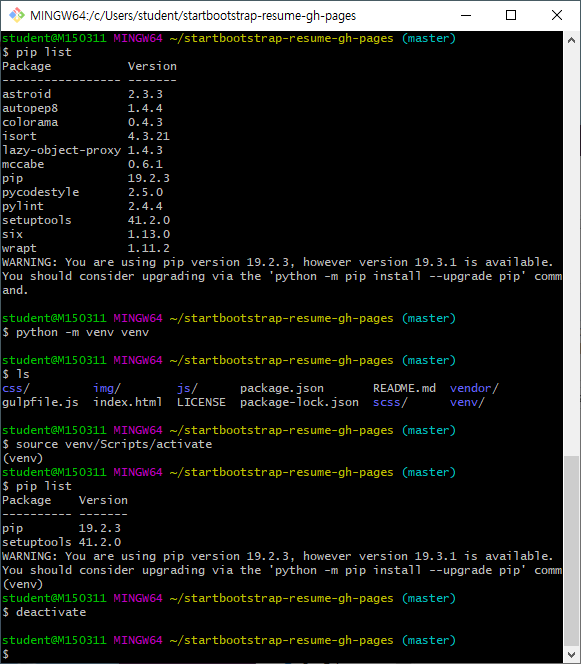

## 1. Python에서의 가상 환경이란?

- 파이썬에서는 한 라이브러리에 대해 하나의 버전만 설치가 가능합니다.
- 여러개의 프로젝트를 진행하게 되면 이는 문제가 됩니다. 작업을 바꿀때마다 다른 버전의 라이브러리를 설치해야합니다.
- 이를 방지하기 위한 격리된 독립적인 가상환경을 제공합니다.
- 일반적으로 프로젝트마다 다른 하나의 가상환경을 생성한 후 작업을 시작하게 됩니다.
- 가상환경의 대표적인 모듈은 3가지가 있습니다.
  - **venv : Python 3.3 버전 이후 부터 기본모듈에 포함됨**
  - virtualenv : Python 2 버전부터 사용해오던 가상환경 라이브러리, Python 3에서도 사용가능
  - conda : Anaconda Python을 설치했을 시 사용할 수있는 모듈
  - pyenv : pyenv의 경우 Python Version Manger임과 동시에 가상환경 기능을 플러그인 형태로 제공

> 위 문구 출처 [suwoni-codelab.com]([https://suwoni-codelab.com/python%20%EA%B8%B0%EB%B3%B8/2018/03/21/Python-Basic-Virtual-Environment/](https://suwoni-codelab.com/python 기본/2018/03/21/Python-Basic-Virtual-Environment/))


``` shell
$ python -m venv venv
```

ls로 venv/ 확인

``` shell
$ source venv/Scripts/activate
```

(venv) 확인

``` shell
$ pip list
```

비활성화

``` shell
$ deactivate
```

venv 폴더 삭제

``` shell
$ rm -rf venv/
```





> Tip.
>
> `pip` : 파이썬 패키지 관리 시스템
>
> pip freeze \> requirements.txt 
>
> pip install -r requirements.txt

