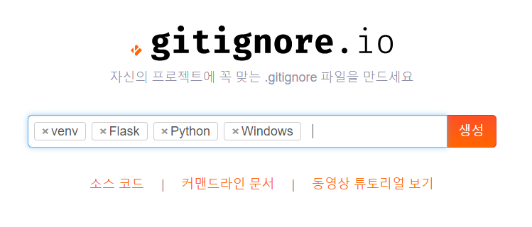

## gitignore

원격저장소에 프로젝트 및 수정 파일을 올릴 때, 올리고 싶지 않은 파일 및 폴더를 설정하여 제외시키는 목적으로 사용.




위 결과)

> ```
> # Created by https://www.gitignore.io/api/venv,flask,python,windows
> # Edit at https://www.gitignore.io/?templates=venv,flask,python,windows
> 
> ### Flask ###
> instance/*
> !instance/.gitignore
> .webassets-cache
> 
> ### Flask.Python Stack ###
> # Byte-compiled / optimized / DLL files
> __pycache__/
> *.py[cod]
> *$py.class
> 
> # C extensions
> *.so
> 
> # Distribution / packaging
> .Python
> build/
> develop-eggs/
> dist/
> downloads/
> eggs/
> .eggs/
> lib/
> lib64/
> parts/
> sdist/
> var/
> wheels/
> pip-wheel-metadata/
> share/python-wheels/
> *.egg-info/
> .installed.cfg
> *.egg
> MANIFEST
> 
> # PyInstaller
> #  Usually these files are written by a python script from a template
> #  before PyInstaller builds the exe, so as to inject date/other infos into it.
> *.manifest
> *.spec
> 
> # Installer logs
> pip-log.txt
> pip-delete-this-directory.txt
> 
> # Unit test / coverage reports
> htmlcov/
> .tox/
> .nox/
> .coverage
> .coverage.*
> .cache
> nosetests.xml
> coverage.xml
> *.cover
> .hypothesis/
> .pytest_cache/
> 
> # Translations
> *.mo
> *.pot
> 
> # Scrapy stuff:
> .scrapy
> 
> # Sphinx documentation
> docs/_build/
> 
> # PyBuilder
> target/
> 
> # pyenv
> .python-version
> 
> # pipenv
> #   According to pypa/pipenv#598, it is recommended to include Pipfile.lock in version control.
> #   However, in case of collaboration, if having platform-specific dependencies or dependencies
> #   having no cross-platform support, pipenv may install dependencies that don't work, or not
> #   install all needed dependencies.
> #Pipfile.lock
> 
> # celery beat schedule file
> celerybeat-schedule
> 
> # SageMath parsed files
> *.sage.py
> 
> # Spyder project settings
> .spyderproject
> .spyproject
> 
> # Rope project settings
> .ropeproject
> 
> # Mr Developer
> .mr.developer.cfg
> .project
> .pydevproject
> 
> # mkdocs documentation
> /site
> 
> # mypy
> .mypy_cache/
> .dmypy.json
> dmypy.json
> 
> # Pyre type checker
> .pyre/
> 
> ### Python ###
> # Byte-compiled / optimized / DLL files
> 
> # C extensions
> 
> # Distribution / packaging
> 
> # PyInstaller
> #  Usually these files are written by a python script from a template
> #  before PyInstaller builds the exe, so as to inject date/other infos into it.
> 
> # Installer logs
> 
> # Unit test / coverage reports
> 
> # Translations
> 
> # Scrapy stuff:
> 
> # Sphinx documentation
> 
> # PyBuilder
> 
> # pyenv
> 
> # pipenv
> #   According to pypa/pipenv#598, it is recommended to include Pipfile.lock in version control.
> #   However, in case of collaboration, if having platform-specific dependencies or dependencies
> #   having no cross-platform support, pipenv may install dependencies that don't work, or not
> #   install all needed dependencies.
> 
> # celery beat schedule file
> 
> # SageMath parsed files
> 
> # Spyder project settings
> 
> # Rope project settings
> 
> # Mr Developer
> 
> # mkdocs documentation
> 
> # mypy
> 
> # Pyre type checker
> 
> ### venv ###
> # Virtualenv
> # http://iamzed.com/2009/05/07/a-primer-on-virtualenv/
> [Bb]in
> [Ii]nclude
> [Ll]ib
> [Ll]ib64
> [Ll]ocal
> [Ss]cripts
> pyvenv.cfg
> .env
> .venv
> env/
> venv/
> ENV/
> env.bak/
> venv.bak/
> pip-selfcheck.json
> 
> ### Windows ###
> # Windows thumbnail cache files
> Thumbs.db
> Thumbs.db:encryptable
> ehthumbs.db
> ehthumbs_vista.db
> 
> # Dump file
> *.stackdump
> 
> # Folder config file
> [Dd]esktop.ini
> 
> # Recycle Bin used on file shares
> $RECYCLE.BIN/
> 
> # Windows Installer files
> *.cab
> *.msi
> *.msix
> *.msm
> *.msp
> 
> # Windows shortcuts
> *.lnk
> 
> # End of https://www.gitignore.io/api/venv,flask,python,windows
> ```


위 내용 .gitignore 파일 생성 및 저장 -> push

