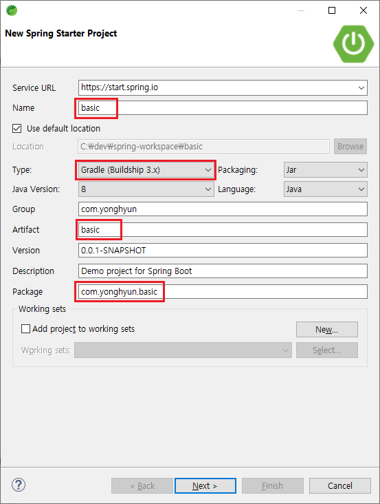
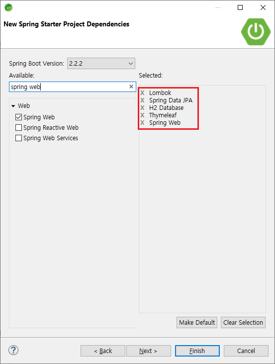
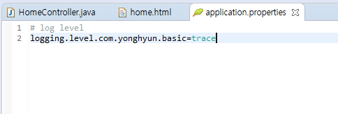
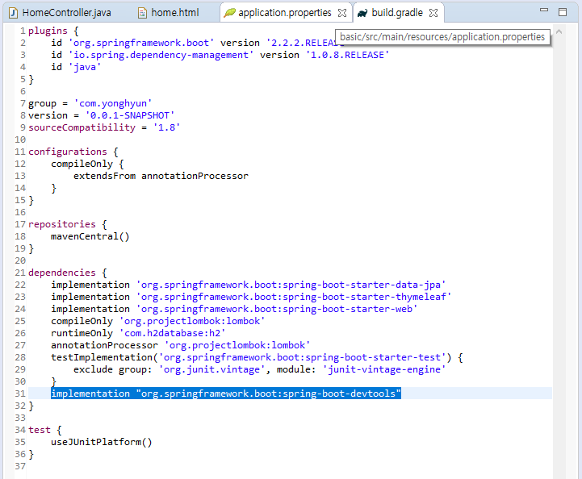
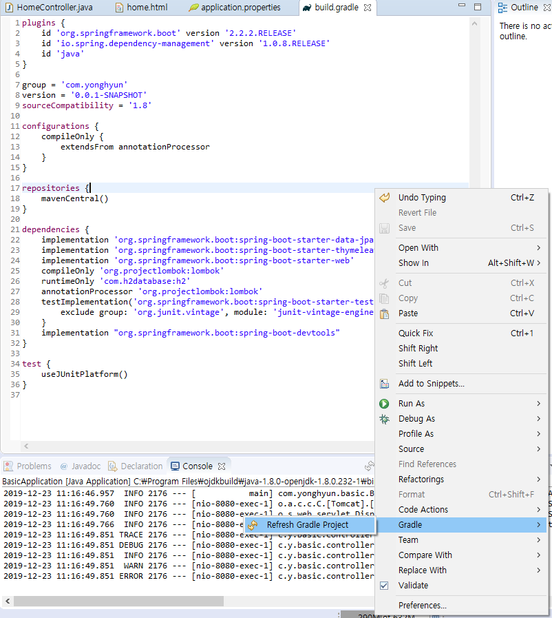

# Spring basic

### 0. 스프링 부트

웹 애플리케이션 제작

Java, HTML/CSS/JS, Datsbase + Spring


### 1. 설치

> STS 설치
>
> https://spring.io/tools
>
> 다운로드된 파일 위치 이동 > 파일탐색기 > 파일 > Windows powershell > 압축풀기
>
> \> java -jar .\spring-tool-suite-4-4.5.0.RELEASE-e4.14.0-win32.win32.x86_64.self-extracting.jar
>
> 위 명령어 입력 안될 시, java 환경변수 확인 및 재설정
>
> SpringToolSuite4.exe 실행


> Lombok library 설치
>
> https://projectlombok.org/all-versions
>
> 사용할 버전 lombok-1.18.10.jar
>
> 다운로드된 파일 위치 이동 > 파일탐색기 > 파일 > Windows powershell > 압축풀기
>
> \> java -jar .\lombok.jar


`롬복(lombok)` 적용 안되면 `gradle reflash` and `build` 하면됨

**!! 윈도우 계정이 한글이면 안됨 !!**


### 2. Start project



Name : basic

Type : Gradle (Buildship 3.x)

Group : com.yonghyun

Package : com.yonghyun.basic

> Gradle / Maven ?




Spring Web : 웹 프로젝트

Thymeleaf : 뷰 템플릿 (HTML)

JPA : 데이터베이스 템플릿

H2 : 데이터베이스

Lombok : 메소드 등 기능 보조


위 파일에서 Ctrl + F11 로 실행


### 3. Run Hello

#### @RestController


New package and class

```java
package com.yonghyun.basic.controller;

import org.springframework.web.bind.annotation.GetMapping;
import org.springframework.web.bind.annotation.RestController;

@RestController
public class testController {
	@GetMapping("/test")
	public String test() {
		return "Hello";
	}
}
```

>  Tip. 전체 import
>
>  `Shift` + `Ctrl` + `O`


> **@ (Annotation)**
>
> ​	- java compiler를 위한 주석 (https://elfinlas.github.io/2017/12/14/java-annotation/)
>
> **@RestController / @Controller ?** (https://mangkyu.tistory.com/49)
>
> ​	- Controller class 라는 것을 spring에게 알려줌
>
> ​	- @Controller - templates폴더 밑에 해당 html 파일 실행
>
> **@GetMapping / @RequestMapping ?**
>
> ​	- New style : @GetMapping("req/get")
>
> ​	- Old style : @RequestMapping(value = "req/get", method = RequestMethod.GET)
>
> ​	


```java
return "<h1>Hello!!</h1>";
```


#### @Controller

New class

```java
package com.yonghyun.basic.controller;

import org.springframework.stereotype.Controller;
import org.springframework.web.bind.annotation.GetMapping;

@Controller
public class test2Controller {
	@GetMapping("/test2")
	public String test2() {
		return "hello";
	}
}
```


>  Tip. 코드 정렬
>
>  Shift + Crtl + F


### 4. STS 인코딩 설정 변경

Windwos > Preference > encoding 검색 > 전부 utf-8 적용


### 5. Log 사용법

#### 방법1 (slf4j)

> **slf4j logger library**
>
> 1. System.out.println 보다 출력 속도가 빠름
> 2. 파일 등을 이용하여 log 관리가 쉬움


```java
package com.yonghyun.basic.controller;

import org.slf4j.Logger;
import org.slf4j.LoggerFactory;
import org.springframework.stereotype.Controller;
import org.springframework.web.bind.annotation.RequestMapping;

@Controller
public class HomeController {
	Logger logger = LoggerFactory.getLogger(this.getClass());
	@RequestMapping("/")
	public String home() {
		logger.trace("trace!");
		logger.debug("debug!"); // 개발단계 확인용
		logger.info("info!");	// 운용 상 필요한 정보
		logger.warn("warning!");// 메모리 문제 등 경고
		logger.error("error!");	// 치명적인 오류
		return "home";
	}
}
```


#### log level 설정

resources >  application.properties

```java
# log level
logging.level.com.yonghyun.basic=trace
```



> 참고 사이트 http://logback.qos.ch/manual/


#### 방법2 (Lombok)

```java
package com.yonghyun.basic.controller;

import org.springframework.stereotype.Controller;
import org.springframework.web.bind.annotation.RequestMapping;
import lombok.extern.slf4j.Slf4j;

@Slf4j
@Controller
public class HomeController {
	@RequestMapping("/")
	public String home() {
		log.trace("trace!");
		log.debug("debug!");
		log.info("info!");
		log.warn("warn!");
		log.error("error!");
		return "home";
	}
}
```


>  Tip. 열 편집 모드
>
> Shift + Alt + a


### 6. 자동 재구동

build.gradle

```java
implementation "org.springframework.boot:spring-boot-devtools"
```





