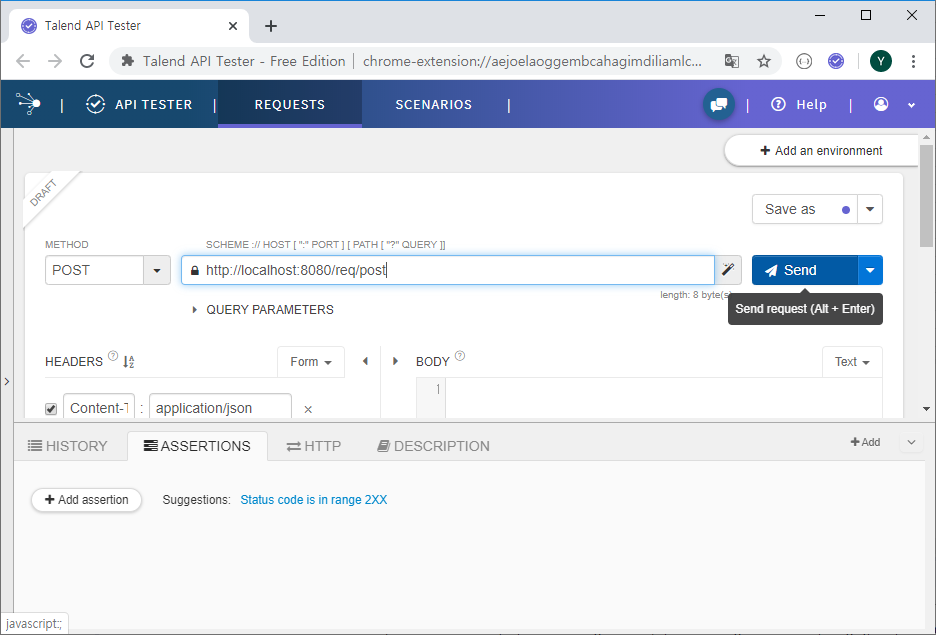

# Spring request

### 1. 응답

#### HTML

- 대표적으로 `String`

```java
@GetMapping("html/object")
public Member htmlObject() {
    Member member = new Member();
    member.setName("kim");
    return member;
}
```


#### JSON

- `Map`, `Array`, `List`, `Object` 와 같이 주로 데이터를 담을 수 있는 경우

- `@ResponseBody` 사용

  >  또는 `@RestController` 를 사용하면 모든 Mapping에 ResponseBody 붙은 것과 동일

```java
@GetMapping("html/object")
@ResponseBody
public Member htmlObject() {
    Member member = new Member();
    member.setName("kim");
    return member;
}
```


### 2. 요청 처리

> 요청 - url을 부르는 것
>
> 요청 시 단서를 보내는 것 - 파라미터


#### a. HTTP method

- POST / GET / PUT / DELETE

```java
package com.yonghyun.basic.controller;

import org.springframework.web.bind.annotation.GetMapping;
import org.springframework.web.bind.annotation.PostMapping;
import org.springframework.web.bind.annotation.RequestMapping;
import org.springframework.web.bind.annotation.RequestMethod;
import org.springframework.web.bind.annotation.RestController;

@RestController
public class MethodController {
	@GetMapping("req/get")	// new style
	//@RequestMapping(value = "req/get", method = RequestMethod.GET)	// old style
	public String get() {
		return "GET";
	}

	@PostMapping("req/post")
	//@RequestMapping(value = "req/post", method = RequestMethod.POST)
	public String post() {
		return "POST";
	}
}
```


- post 방식은 일반적인 방법으로 테스트 하기 어려움


#### restlet client

- 위 연습을 위해 확장프로그램 restlet client 검색, Talend API Tester 설치





#### b. HttpServletRequest

- 가장 전통적인 방식 (이제 잘 안씀)

```java
@GetMapping("req/http")
public String http(HttpServletRequest request) {
    String name = request.getParameter("name");
    String pageNum = request.getParameter("pageNum");
    return name + ", " + pageNum;
}
```


#### c. RequestParam

- 파라미터 명칭에 맞게 변수 사용

- 파라미터 종류 및 개수 상관없이 사용

- 요청 시 지정된 파라미터가 없는 경우 400 오류 (기본값)

```java
@GetMapping("req/param1")
    public String param1(
    @RequestParam("key1") String key1,
    @RequestParam("key2") String key2) {
    return key1 + ", " + key2;
}
```


```java
@GetMapping("req/param2")
    public String param2(
    @RequestParam Map<String, Object> map) {
    return map.toString();
}
```


#### d. PathVariable

- 요청을 처리하는 주소에 {변수명} 형식으로 지정

```java
@GetMapping("req/path/{path1}/{path2}")
    public String path(
    @PathVariable("path1") String path1,
    @PathVariable("path2") String path2) {
    return path1 + ", " + path2;
}
```


#### e. ModelAttribute

- Model / DTO / VO 등 객체와 연계하여 활용

```java
@GetMapping("req/model")
    public String model(
    @ModelAttribute Member member) {
    return member.toString();
}
```


#### f. RequestBody

???


### 3. HTML Template – Thymeleaf