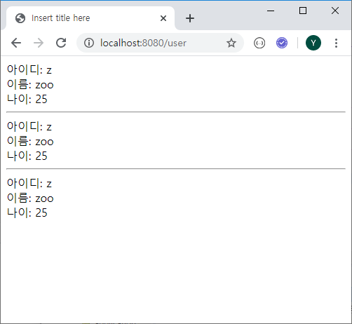

# Spring request

### 1. 응답

#### HTML

- 대표적으로 `String`

```java
@GetMapping("html/object")
public Member htmlObject() {
    Member member = new Member();
    member.setName("kim");
    return member;
}
```


#### JSON

- `Map`, `Array`, `List`, `Object` 와 같이 주로 데이터를 담을 수 있는 경우

- `@ResponseBody` 사용

  >  또는 `@RestController` 를 사용하면 모든 Mapping에 ResponseBody 붙은 것과 동일

```java
@GetMapping("html/object")
@ResponseBody
public Member htmlObject() {
    Member member = new Member();
    member.setName("kim");
    return member;
}
```


### 2. 요청 처리

> 요청 - url을 부르는 것
>
> 요청 시 단서를 보내는 것 - 파라미터


#### a. HTTP method

- POST / GET / PUT / DELETE

```java
package com.yonghyun.basic.controller;

import org.springframework.web.bind.annotation.GetMapping;
import org.springframework.web.bind.annotation.PostMapping;
import org.springframework.web.bind.annotation.RequestMapping;
import org.springframework.web.bind.annotation.RequestMethod;
import org.springframework.web.bind.annotation.RestController;

@RestController
public class MethodController {
	@GetMapping("req/get")	// new style
	//@RequestMapping(value = "req/get", method = RequestMethod.GET)	// old style
	public String get() {
		return "GET";
	}

	@PostMapping("req/post")
	//@RequestMapping(value = "req/post", method = RequestMethod.POST)
	public String post() {
		return "POST";
	}
}
```


- post 방식은 일반적인 방법으로 테스트 하기 어려움


#### restlet client

- 위 연습을 위해 확장프로그램 restlet client 검색, Talend API Tester 설치


#### b. HttpServletRequest

- 가장 전통적인 방식 (이제 잘 안씀)

```java
@GetMapping("req/http")
public String http(HttpServletRequest request) {
    String name = request.getParameter("name");
    String pageNum = request.getParameter("pageNum");
    return name + ", " + pageNum;
}
```


#### c. RequestParam

- 파라미터 명칭에 맞게 변수 사용

- 파라미터 종류 및 개수 상관없이 사용

- 요청 시 지정된 파라미터가 없는 경우 400 오류 (기본값)

```java
@GetMapping("req/param1")
    public String param1(
    @RequestParam("key1") String key1,
    @RequestParam("key2") String key2) {
    return key1 + ", " + key2;
}
```


```java
@GetMapping("req/param2")
    public String param2(
    @RequestParam Map<String, Object> map) {
    return map.toString();
}
```


#### d. PathVariable

- 요청을 처리하는 주소에 {변수명} 형식으로 지정

```java
@GetMapping("req/path/{path1}/{path2}")
    public String path(
    @PathVariable("path1") String path1,
    @PathVariable("path2") String path2) {
    return path1 + ", " + path2;
}
```


#### e. ModelAttribute

- Model / DTO / VO 등 객체와 연계하여 활용

```java
@GetMapping("req/model")
    public String model(
    @ModelAttribute Member member) {
    return member.toString();
}
```


#### f. RequestBody

???


### 3. HTML Template – Thymeleaf

- 스프링 부트에서 권장하는 HTML Template

- HTML5 문법을 사용하는 HTML 태그 및 속성 기반의 Template Engine

- 텍스트, HTML, XML, JavaScript, CSS 등 생성 가능

- Controller에서 View로 넘겨준 Model을 이용하여 데이터 출력


#### a. 기본 사용법

```java
@Controller
public class Welcome {
	@GetMapping("/welcome")
	public String welcome(Model model) {
		List<String> list = new ArrayList<>();
		list.add("a");
		list.add("b");
		model.addAttribute("key1", list);
		
		Map<String, Object> map = new HashMap<>();
		map.put("a", "value a");
		map.put("b", "value b");
		model.addAttribute("key2", map);
		
		return "welcome";
	}
}
```

```html
[[${key1}]]
<br>
[[${key1[0]}]]
<br>
[[${key2}]]
<br>
[[${key2.a}]]
<br>
[[${key2['b']}]]
```


#### b. Variable Expression

```java
@GetMapping("user")
public String user(Model model) {
    Map<String, Object> user = null;
    user = new HashMap<>();
    user.put("userId", "z");
    user.put("userName", "zoo");
    user.put("userAge", 25);
    model.addAttribute("user", user);
    return "user";
}
```

> user.html

```html
<!DOCTYPE html>
<html xmlns:th="http://www.thymeleaf.org">
<head>
<meta charset="UTF-8">
<title>Insert title here</title>
</head>
<body>
	아이디:
	<span>[[${user.userId}]]</span>
	<br> 이름:
	<span>[[${user.userName}]]</span>
	<br> 나이:
	<span>[[${user.userAge}]]</span>
	<br>
	<hr>
	아이디:
	<span th:text="${user.userId}"></span>
	<br> 이름:
	<span th:text="${user.userName}"></span>
	<br> 나이:
	<span th:text="${user.userAge}"></span>
	<br>
	<hr>
	아이디:
	<span data-th-text="${user.userId}"></span>
	<br> 이름:
	<span data-th-text="${user.userName}"></span>
	<br> 나이:
	<span data-th-text="${user.userAge}"></span>
	<br>
</body>
</html>
```




#### c. Iteration / th:each

```java
@GetMapping("userList")
public String userList(Model model) {
    List<Map<String, Object>> userList = new ArrayList<>();
    Map<String, Object> user = null;
    user = new HashMap<>();
    user.put("userId", "a");
    user.put("userName", "apple");
    user.put("userAge", 21);
    userList.add(user);
    user = new HashMap<>();
    user.put("userId", "b");
    user.put("userName", "banana");
    user.put("userAge", 22);
    userList.add(user);
    user = new HashMap<>();
    user.put("userId", "c");
    user.put("userName", "carrot");
    user.put("userAge", 23);
    userList.add(user);
    model.addAttribute("userList", userList);
    return "userList";
}
```

> userList.html

```html
<!DOCTYPE html>
<html xmlns:th="http://www.thymeleaf.org">
<head>
<meta charset="UTF-8">
<title>Insert title here</title>
</head>
<body>
	<table border="1">
		<tr>
			<td>아이디</td>
			<td>이름</td>
			<td>나이</td>
		</tr>
		<tr th:each="user : ${userList}">
			<td th:text="${user.userId}"></td>
			<td th:text="${user.userName}"></td>
			<td th:text="${user.userAge}"></td>
		</tr>
	</table>
	<hr>
	<th:block th:each="pageNumber : ${#numbers.sequence(1, 10)}">
		<span th:text="${pageNumber}"></span>
	</th:block>
</body>
</html>
```


#### d-1. Conditional Evaluation / th:if, th:unless, th:switch

```java
@GetMapping("mode")
public String mode(Model model, @RequestParam Map<String, Object> map) {
    model.addAttribute("name", map.get("name"));
    model.addAttribute("auth", map.get("auth"));
    model.addAttribute("category", map.get("category"));
    return "mode";
}
```

> mode.html

```html
<!DOCTYPE html>
<html xmlns:th="http://www.thymeleaf.org">
<head>
<meta charset="UTF-8">
</head>
<body>
	관리자 이름 :
	<span th:if="${name} != null" th:text="${name}"></span>
	<span th:unless="${name} != null" th:text="이름없음"></span>
	<br> 권한 :
	<span th:text="${auth} != null ? ${auth} : '권한없음'"></span>
	<br> 담당 카테고리 :
	<span th:switch="${category}"> <span th:case="1">커뮤니티</span> <span
		th:case="2">장터</span> <span th:case="3">갤러리</span>
	</span>
	<br>
</body>
</html>
```


#### d-2. Conditional Evaluation / th:if, th:unless, th:switch

```java
@GetMapping("pagination")
public String pagination(Model model, @RequestParam(defaultValue = "1") int page) {
    int startPage = (page - 1) / 10 * 10 + 1;
    int endPage = startPage + 9;
    model.addAttribute("startPage", startPage);
    model.addAttribute("endPage", endPage);
    model.addAttribute("page", page);
    return "pagination";
}
```

> pagination.html

```html
<!DOCTYPE html>
<html xmlns:th="http://www.thymeleaf.org">
<head>
<meta charset="UTF-8">
<title>Insert title here</title>
</head>
<body>
	<th:block
		th:each="pageNumber : ${#numbers.sequence(startPage, endPage)}">
		<span th:if="${page} == ${pageNumber}" th:text="${pageNumber}"
			style="font-weight: bold"></span>
		<span th:unless="${page} == ${pageNumber}" th:text="${pageNumber}"></span>
	</th:block>
</body>
</html>
```


#### e. Link Url Expression / @{ … }

```java
@GetMapping("linkUrl")
public String linkUrl(Model model, @RequestParam(defaultValue = "1") int page) {
    int startPage = (page - 1) / 10 * 10 + 1;
    int endPage = startPage + 9;
    model.addAttribute("startPage", startPage);
    model.addAttribute("endPage", endPage);
    model.addAttribute("page", page);
    return "linkUrl";
}
```

```html
<!DOCTYPE html>
<html xmlns:th="http://www.thymeleaf.org">
<head>
<meta charset="UTF-8">
<title>Insert title here</title>
</head>
<body>
	<th:block th:each="pageNumber : ${#numbers.sequence(1, 10)}">
		<a th:href="@{/linkUrl(page=${pageNumber})}" th:text="${pageNumber}"></a>
	</th:block>
</body>
</html>
```

