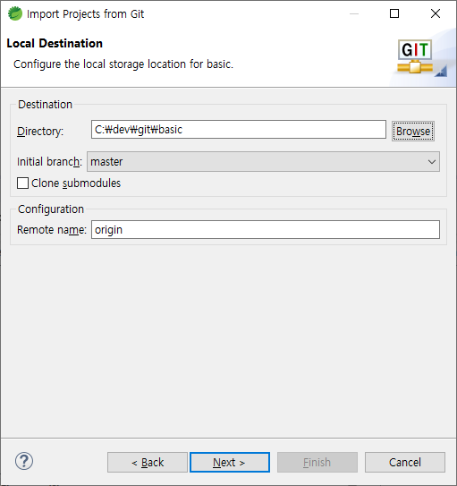

## git push on spring eclipse

### push

1. Project 우클릭 > Team > Share Project...

2. make local repository

3. commit

4. add all (원래는 gitignore 먼저 올리고...) and push

### push 확인

1. 완벽 삭제 후 clone

STS 최신 버전에 무언가 이상이 있는듯..

project import를 위해 basic(내가 만든 project)을 다시 gradle로 import 해줌