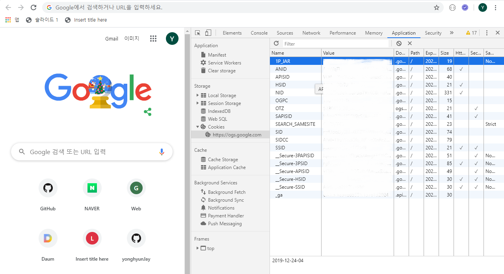
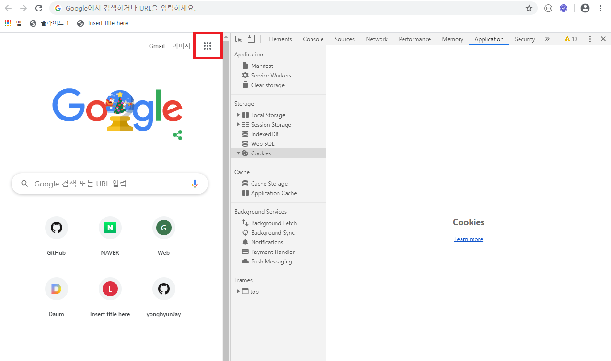
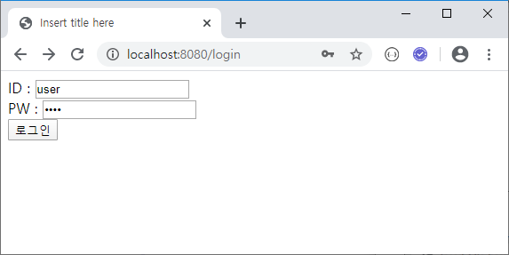

## session

`HTTP[S]` : Hyper Text Transfer Protocol [Secure]

	> (여담) https -> 암호화(서버에 인증서) -> 유료


어쨋든 http든 https든 상태를 저장하지 않음 -> Stateless

그럼 로그인은?

그래서 session을 사용

클라이언트가 접속 시 티켓 전송

브라우저의 임지저장공간(temp == 쿠키)에 티켓 저장

클라이언트가 요청할 때마다 티켓을 함께 보내줌


### 쿠키삭제 (session 만료)

1. 개발자 모드 Application > Cookies



2. 쿠키 내용 삭제


3. 로그인 해제됨




	> 클라이언트에 저장되는 티켓 공간 = 쿠키
	>
	> 서버에 저장되는 티켓 공간 = 세션


### session 실습

>  기존 /login 으로 구성된 controller 제거 (예약된 이름)
>
> 또는 `@Controller` 를 **주석** 처리

#### session controller 작성

```java
package com.yonghyun.basic.controller;

import javax.servlet.http.HttpSession;
import org.springframework.stereotype.Controller;
import org.springframework.web.bind.annotation.GetMapping;
import org.springframework.web.bind.annotation.PostMapping;
import com.yonghyun.basic.model.User;

@Controller
public class SessionController {
	@GetMapping("/login")
	public String login() {
		return "login";
	}

	@PostMapping("/login")
	public String loginPost(
			User user,	// @ModelAttribute("user") User user 가 생략됨
			HttpSession session) {
		// 세션은 어디서든지 (현재 스프링 서버) 사용 가능
		session.setAttribute("user", user);
		// 지정된 주소로 이동(떠넘김)
		return "redirect:/main";
	}

	@GetMapping("/main")
	public String main() {
		return "main";
	}
}
```

#### user model 추가 (in model of package)

```java
package com.yonghyun.basic.model;

import lombok.Data;

@Data
public class User {
	private String userId;
	private String userPw;
}
```

#### login.html (in templates)

```html
<!DOCTYPE html>
<html>
<head>
<meta charset="UTF-8">
<title>Insert title here</title>
</head>
<body>
	<form action="/login" method="post">
		ID : <input type="text" name="userId"><br> PW : <input
			type="password" name="userPw"><br> <input type="submit"
			value="로그인">
	</form>
</body>
</html>

```

#### main.html (in templates)

```html
<!DOCTYPE html>
<html xmlns:th="http://www.thymeleaf.org">
<head>
<meta charset="UTF-8">
<title>Insert title here</title>
</head>
<body>
	<p th:if="${session.user} != null"
		th:text="${session.user.userId} + '님 반갑습니다.'"></p>
	<p th:unless="${session.user} != null">로그인되어 있지 않습니다.</p>
</body>
</html>
```





시크릿 창에는 로그인 되어 있지 않음


