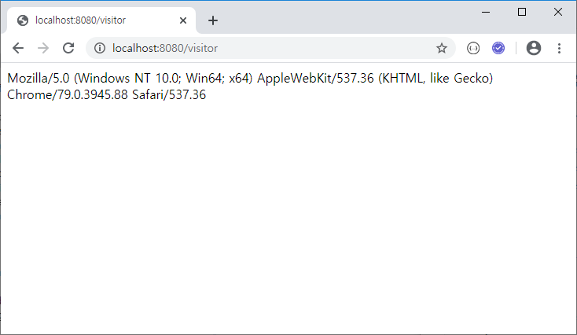
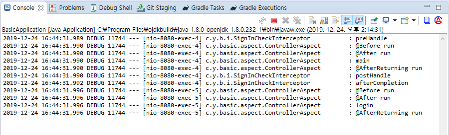
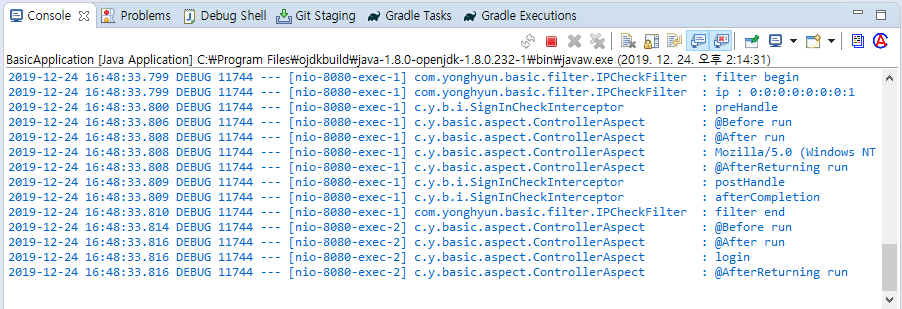

## AOP

Aspect Oriented Programming (관점 지향 프로그래밍)


#### 사용예. 트랜젝션

끝까지 수행하거나 (중간에 문제 생길 시) 처음 상태로 돌려놓거나

임시저장 완벽 수행 시 서버에 저장


#### 주요 용어

>  `Pointcut`
>
>  ​	Joinpoint 중 실제 Advice가 적용되는 지점
>
>  ​	어디에 적용할 건가

> `Advice`
>
> ​	부가기능을 담은 모듈
>
> ​	적용할 기능

> `Aspect`
>
> ​	위 두개 묶어서

> `Joinpoint`
>
> ​	Advice가 적용될 수 있는 지점
>
> ​	언제


#### 실습

Project에 aspect package 추가

```java
package com.yonghyun.basic.aspect;

import org.aspectj.lang.JoinPoint;
import org.aspectj.lang.annotation.After;
import org.aspectj.lang.annotation.AfterReturning;
import org.aspectj.lang.annotation.Aspect;
import org.aspectj.lang.annotation.Before;
import org.springframework.stereotype.Component;

import lombok.extern.slf4j.Slf4j;

@Slf4j
@Aspect
@Component
public class ControllerAspect {
	@Before(value = "execution (* com.yonghyun.basic.controller.*.*(..))")
	public void onBeforeHandler(JoinPoint joinPoint) {
		log.debug("@Before run");
	}

	@After(value = "execution (* com.yonghyun.basic.controller.*.*(..))")
	public void onAfterHandler(JoinPoint joinPoint) {
		log.debug("@After run");
	}

	@AfterReturning(value = "execution (* com.yonghyun.basic.controller.*.*(..))", returning = "data")
	public void onAfterReturningHandler(JoinPoint joinPoint, Object data) {
		if (data != null) {
			log.debug(data.toString());
		}
		log.debug("@AfterReturning run");
	}
}
```


아무 request


위 로그 안나오면 application.properties 에 logging level을 확인 해 보시길..


## filter

#### 1. filter/IPCheckFilter.java 추가

```java
package com.yonghyun.basic.filter;

import java.io.IOException;


import javax.servlet.Filter;
import javax.servlet.FilterChain;
import javax.servlet.ServletException;
import javax.servlet.ServletRequest;
import javax.servlet.ServletResponse;
import javax.servlet.http.HttpServletRequest;


import lombok.extern.slf4j.Slf4j;

@Slf4j
public class IPCheckFilter implements Filter {
	@Override
	public void doFilter(ServletRequest request, ServletResponse response, FilterChain chain)
			throws IOException, ServletException {
		log.debug("filter begin");
		HttpServletRequest req = (HttpServletRequest) request;
		String ip = request.getRemoteAddr();
		log.debug("ip : " + ip);
		chain.doFilter(req, response);
		log.debug("filter end");
	}
}
```


#### 2. config/FilterConfing.java 추가

```java
package com.yonghyun.basic.config;

import javax.servlet.Filter;

import org.springframework.boot.web.servlet.FilterRegistrationBean;
import org.springframework.context.annotation.Bean;
import org.springframework.context.annotation.Configuration;

import com.yonghyun.basic.filter.IPCheckFilter;

@Configuration
public class FilterConfig {
	@Bean
	public FilterRegistrationBean<Filter> getFilterRegistrationBean() {
		FilterRegistrationBean<Filter> bean = new FilterRegistrationBean<>(new IPCheckFilter());
		bean.addUrlPatterns("/visitor");
		return bean;
	}
}
```


#### 3. VisitorController.java 추가

```java
package com.yonghyun.basic.controller;

import org.springframework.web.bind.annotation.GetMapping;
import org.springframework.web.bind.annotation.RequestHeader;
import org.springframework.web.bind.annotation.RestController;

@RestController
public class VisitorController {
	@GetMapping("/visitor")
	public String visitor(@RequestHeader("user-agent") String userAgent) {
		return userAgent;
	}
}
```


#### 4. 출력 확인




## Intercoptor

preHandler(), postHandler() 기준으로 들어오고 나가는 구분이 됨 

#### 1. interceptor/SignInCheckInterceptor.java 추가

```java
package com.yonghyun.basic.interceptor;

import javax.servlet.http.HttpServletRequest;
import javax.servlet.http.HttpServletResponse;
import javax.servlet.http.HttpSession;
import org.springframework.stereotype.Component;
import org.springframework.web.servlet.ModelAndView;
import org.springframework.web.servlet.handler.HandlerInterceptorAdapter;
import com.yonghyun.basic.model.User;
import lombok.extern.slf4j.Slf4j;

@Component
@Slf4j
public class SignInCheckInterceptor extends HandlerInterceptorAdapter {
	@Override
	public boolean preHandle(HttpServletRequest request, HttpServletResponse response, Object handler)
			throws Exception {
		log.debug("preHandle");
		HttpSession session = request.getSession();
		User user = (User) session.getAttribute("user");
		if (user == null) {
			response.sendRedirect("/login");
		}
		return super.preHandle(request, response, handler);
	}

	@Override
	public void postHandle(HttpServletRequest request, HttpServletResponse response, Object handler,
			ModelAndView modelAndView) throws Exception {
		log.debug("postHandle");
		super.postHandle(request, response, handler, modelAndView);
	}

	@Override
	public void afterCompletion(HttpServletRequest request, HttpServletResponse response, Object handler, Exception ex)
			throws Exception {
		log.debug("afterCompletion");
		super.afterCompletion(request, response, handler, ex);
	}
}
```


#### 2. config/SignInCheckInterceptor.java 추가

```java
package com.yonghyun.basic.config;

import org.springframework.beans.factory.annotation.Autowired;
import org.springframework.context.annotation.Configuration;
import org.springframework.web.servlet.config.annotation.InterceptorRegistry;
import org.springframework.web.servlet.config.annotation.WebMvcConfigurer;

import com.yonghyun.basic.interceptor.SignInCheckInterceptor;

@Configuration
public class InterceptorConfig implements WebMvcConfigurer {
	@Autowired
	private SignInCheckInterceptor signInCheckInterceptor;

	@Override
	public void addInterceptors(InterceptorRegistry registry) {
		registry.addInterceptor(signInCheckInterceptor).addPathPatterns("/main");
		WebMvcConfigurer.super.addInterceptors(registry);
	}
}
```


#### 3. 출력 확인




## aop filter interceptor 동시에 확인하고 싶을때..

#### 1. InterceptorConfig.java 수정

```java
@Override
public void addInterceptors(InterceptorRegistry registry) {
    registry.addInterceptor(signInCheckInterceptor)
        .addPathPatterns("/main")
        .addPathPatterns("/visitor");
    WebMvcConfigurer.super.addInterceptors(registry);
}
```

#### 2. 브라우저 http://localhost:8080/visitor 입력

#### 3. 출력 확인




## 면접에서 물어보면..

#### (강력) `AOP` - 어떤 클래스든, 어떤 메소드든 대상 (서버가 아니어도)

#### 	-> Spring의 기능

#### `Filter` - 접속하는 주소(url)를 대상 (서버 존재해야함)

#### 	-> 자바의 고유 기능

#### `Interceptor` - 접속하는 주소(url)를 대상

#### 	-> Spring의 기능