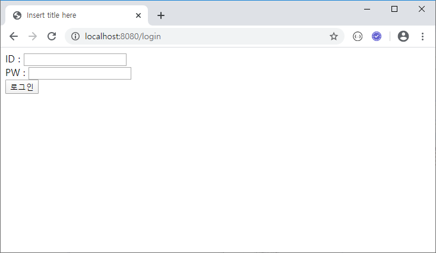
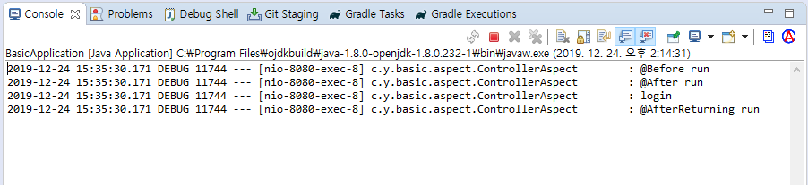

### AOP

Aspect Oriented Programming (관점 지향 프로그래밍)


#### 사용예. 트랜젝션

끝까지 수행하거나 (중간에 문제 생길 시) 처음 상태로 돌려놓거나

임시저장 완벽 수행 시 서버에 저장


#### 주요 용어

>  `Pointcut`
>
>  ​	Joinpoint 중 실제 Advice가 적용되는 지점
>
>  ​	어디에 적용할 건가

> `Advice`
>
> ​	부가기능을 담은 모듈
>
> ​	적용할 기능

> `Aspect`
>
> ​	위 두개 묶어서

> `Joinpoint`
>
> ​	Advice가 적용될 수 있는 지점
>
> ​	언제


#### 실습

Project에 aspect package 추가

```java
package com.yonghyun.basic.aspect;

import org.aspectj.lang.JoinPoint;
import org.aspectj.lang.annotation.After;
import org.aspectj.lang.annotation.AfterReturning;
import org.aspectj.lang.annotation.Aspect;
import org.aspectj.lang.annotation.Before;
import org.springframework.stereotype.Component;

import lombok.extern.slf4j.Slf4j;

@Slf4j
@Aspect
@Component
public class ControllerAspect {
	@Before(value = "execution (* com.yonghyun.basic.controller.*.*(..))")
	public void onBeforeHandler(JoinPoint joinPoint) {
		log.debug("@Before run");
	}

	@After(value = "execution (* com.yonghyun.basic.controller.*.*(..))")
	public void onAfterHandler(JoinPoint joinPoint) {
		log.debug("@After run");
	}

	@AfterReturning(value = "execution (* com.yonghyun.basic.controller.*.*(..))", returning = "data")
	public void onAfterReturningHandler(JoinPoint joinPoint, Object data) {
		if (data != null) {
			log.debug(data.toString());
		}
		log.debug("@AfterReturning run");
	}
}
```


아무 request






