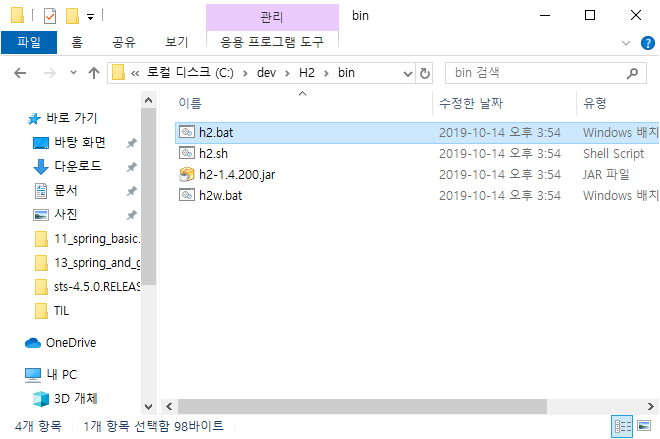
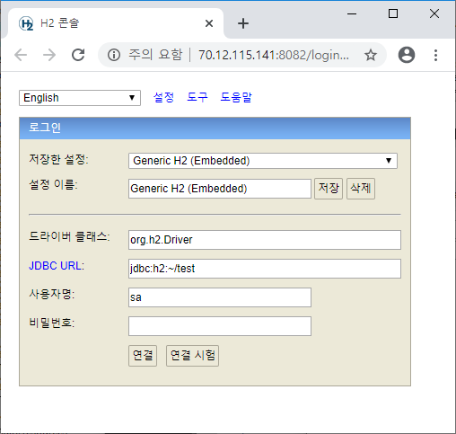
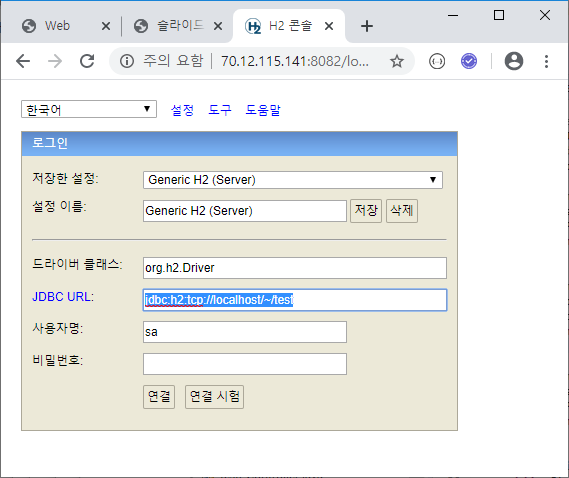
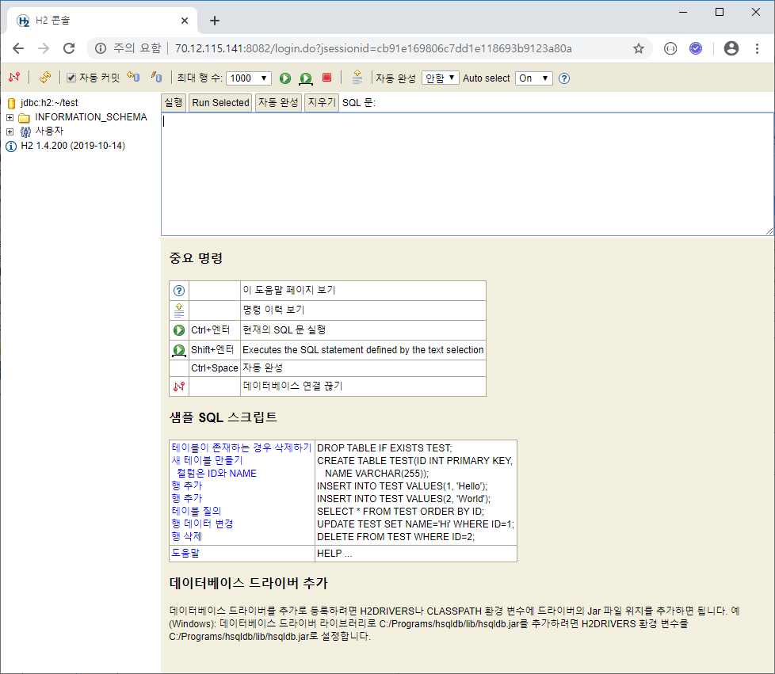
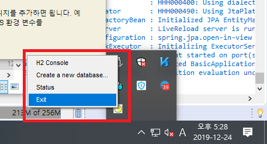
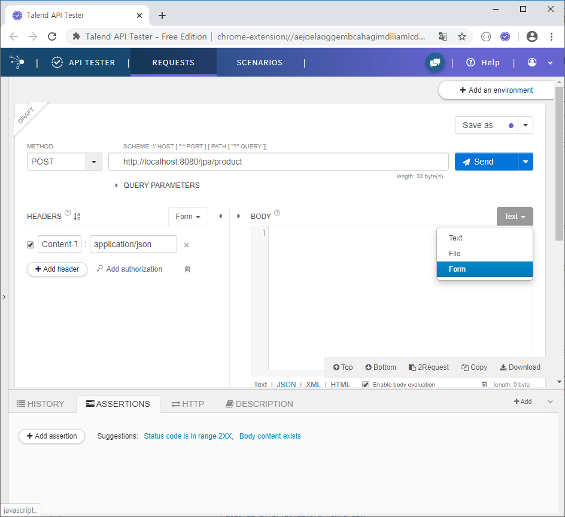
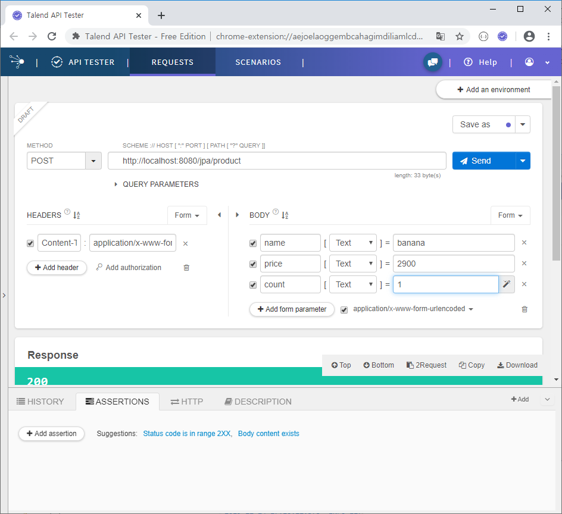
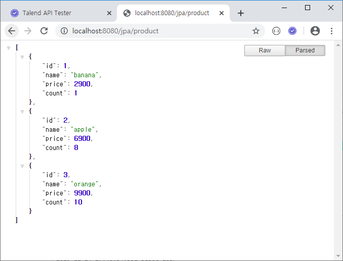
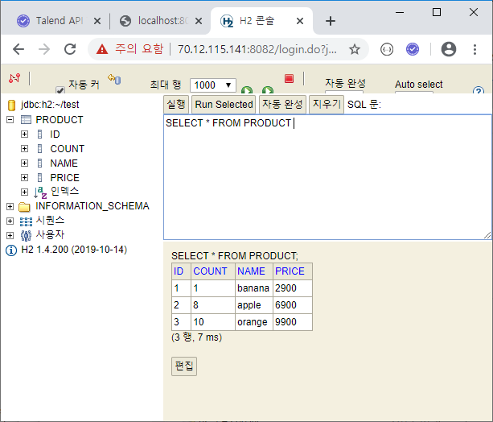

## JPA

Java Persistence API

DB-자바 연결


### JPA 실습

#### 1. application.properties 수정

```java
# log level
logging.level.com.yonghyun.basic=trace

# datasource
spring.datasource.url=jdbc:h2:~/test
spring.datasource.driverClassName=org.h2.Driver
spring.datasource.username=sa
spring.datasource.password=

# jpa
spring.jpa.hibernate.ddl-auto=update
spring.jpa.database-platform=org.hibernate.dialect.H2Dialect
spring.jpa.show-sql=true
```


#### 2. 간단 DB 다운로드

https://h2database.com/html/main.html

왠만하면.. C:\dev\H2 요기에 설치


#### 3. h2.bat 실행





(Embedded) 옵션일 경우 spring 서버와 동시에 사용 안됨

> Embedded -> server 로 구동하려면..
>
> 
>
> application.properties 수정
>
> JDBC URL을 application.properties에 수정
>
> ```java
> # datasource
> spring.datasource.url=jdbc:h2:tcp://localhost/~/test
> ```


연결누르면 C:\\Users\\[PC계정이름] 경로에 아래 파일 생성 확인

- test.mv.db




트레이 아이콘에 h2 > exit 해야 spring 서버 구동 할 수 있음




#### 4. model/Product.java 추가

```java
package com.yonghyun.basic.model;

import javax.persistence.Entity;
import javax.persistence.GeneratedValue;
import javax.persistence.GenerationType;
import javax.persistence.Id;
import lombok.Data;

@Data
@Entity
public class Product {
	@Id
	@GeneratedValue(strategy = GenerationType.AUTO)
	private long id;
	private String name;
	private int price;
	private int count;
}
```


#### 5. repository/ProductRepository.java 추가

```java
package com.yonghyun.basic.repository;

import org.springframework.data.jpa.repository.JpaRepository;
import org.springframework.stereotype.Repository;

import com.yonghyun.basic.model.Product;

@Repository
public interface ProductRepository extends JpaRepository<Product, Long> {
}
```


#### 6. controller/JpaController.java 추가

```java
package com.yonghyun.basic.controller;

import java.util.List;
import org.springframework.beans.factory.annotation.Autowired;
import org.springframework.web.bind.annotation.GetMapping;
import org.springframework.web.bind.annotation.ModelAttribute;
import org.springframework.web.bind.annotation.PostMapping;
import org.springframework.web.bind.annotation.RestController;
import com.yonghyun.basic.model.Product;
import com.yonghyun.basic.repository.ProductRepository;


@RestController
public class JpaController {
	@Autowired
	ProductRepository productRepository;

	@GetMapping("/jpa/product")
	public List<Product> product() {
		List<Product> list = productRepository.findAll();
		return list;
	}

	@PostMapping("/jpa/product")
	public String productPost(@ModelAttribute Product product) {
		productRepository.save(product);
		return "redirect:/jpa/product";
	}
}
```


#### 7. rest client 로 POST send





데이터 몇개 전송 후


#### 8. DB 확인

##### a. 브라우저로 http://localhost:8080/jpa/product 확인




##### b. spring 끄고 > h2.bat 실행 > Product 선택 > Run Selected 

