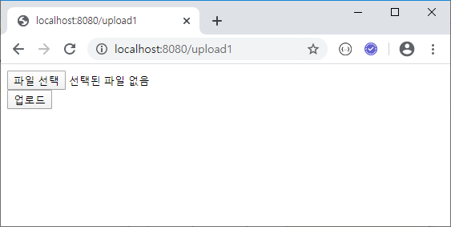
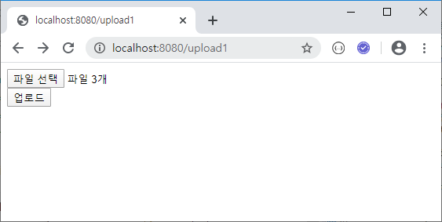
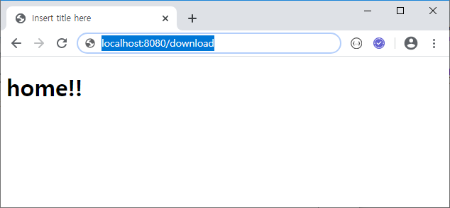
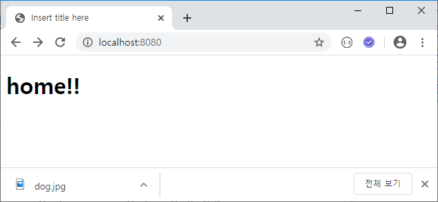
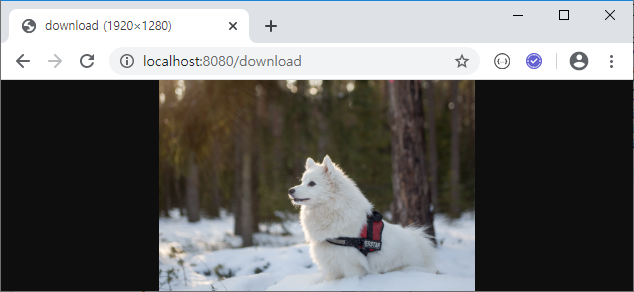
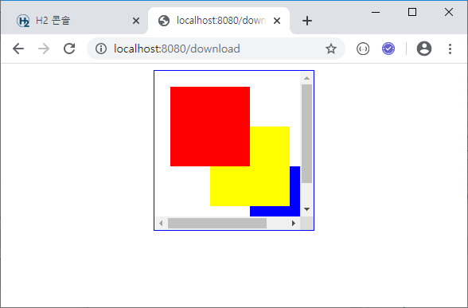
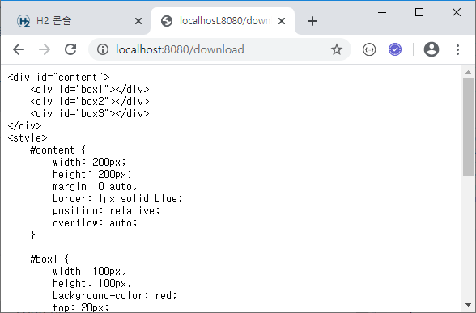

# JPA

### 1. File upload

#### 방법1) MultipartHttpServletRequest

​	방법2, 방법3 보다 많은 부분의 제어가 가능


> controller/UploadController.java

```java
package com.yonghyun.basic.controller;

import java.io.File;
import java.io.IOException;

import org.springframework.stereotype.Controller;
import org.springframework.web.bind.annotation.GetMapping;
import org.springframework.web.bind.annotation.PostMapping;
import org.springframework.web.bind.annotation.ResponseBody;
import org.springframework.web.multipart.MultipartFile;
import org.springframework.web.multipart.MultipartHttpServletRequest;

@Controller
public class UploadController {
	@GetMapping("/upload1")
	public String upload1() {
		return "upload1";
	}

	@PostMapping("/upload1")
	@ResponseBody
	public String upload1Post(MultipartHttpServletRequest mRequest) {
		String result = "";
		// 업로드 된 파일 정보
		MultipartFile mFile = mRequest.getFile("file");
		
		String oName = mFile.getOriginalFilename();
		
		// 지정 경로에 지정 파일명으로 저장
		try {
			mFile.transferTo(new File("C:/dev/" + oName));
		} catch (IllegalStateException e) {
			e.printStackTrace();
		} catch (IOException e) {
			e.printStackTrace();
		}
				
		result += oName + "\n";
		return result;
	}
}
```

> templates/upload1.html
>
> `multiple` : 여러 파일 선택 가능

```html
<form method="post" enctype="multipart/form-data">
	<input type="file" name="file" multiple><br>
	<input type="submit" value="업로드">
</form>
```

> application.properties

```java
# file upload
spring.servlet.multipart.max-file-size=2097152
spring.servlet.multipart.max-request-size=2097152
```




>  파일 다중 선택
>
>  ```java
>  @PostMapping("/upload1")
>  	@ResponseBody
>  	public String upload1Post(MultipartHttpServletRequest mRequest) {
>  		String result = "";
>  
>  		List<MultipartFile> mFiles = mRequest.getFiles("file");
>  
>  		for (int i = 0; i < mFiles.size(); i++) {
>  			// 업로드 된 파일 정보
>  			MultipartFile mFile = mFiles.get(i);
>  
>  			String oName = mFile.getOriginalFilename();
>  			result += oName + "\n";
>  
>  			// 지정 경로에 지정 파일명으로 저장
>  			try {
>  				mFile.transferTo(new File("C:/dev/" + oName));
>  			} catch (IllegalStateException e) {
>  				e.printStackTrace();
>  			} catch (IOException e) {
>  				e.printStackTrace();
>  			}
>  		}
>  
>  		return result;
>  	}
>  ```
>
>  


#### 방법2) @RequestParam

스프링부트-2.pdf page 41

#### 방법3) @ModelAttribute

스프링부트-2.pdf page 43


### 2. File download

```java
package com.yonghyun.basic.controller;

import java.io.File;
import java.io.FileInputStream;
import java.net.URLEncoder;
import org.springframework.core.io.InputStreamResource;
import org.springframework.core.io.Resource;
import org.springframework.http.MediaType;
import org.springframework.http.ResponseEntity;
import org.springframework.stereotype.Controller;
import org.springframework.web.bind.annotation.GetMapping;

@Controller
public class DownloadController {
	@GetMapping("/download")
	public ResponseEntity<Resource> download() throws Exception {
		File file = new File("C:/dev/dog.jpg");
		InputStreamResource resource = new InputStreamResource(new FileInputStream(file));
		return ResponseEntity.ok()
				.header("content-disposition", "filename=" + URLEncoder.encode(file.getName(), "utf-8"))
				.contentLength(file.length())
				.contentType(MediaType.parseMediaType("application/octet-stream"))
//				.contentType(MediaType.parseMediaType("image/jpeg"))
				.body(resource);
	}
}
```





##### mime-type

https://developer.mozilla.org/ko/docs/Web/HTTP/Basics_of_HTTP/MIME_types

###### C:/dev/dog.jpg

> .contentType(MediaType.parseMediaType("application/octet-stream"))



> .contentType(MediaType.parseMediaType("image/jpeg"))




###### C:/dev/vs-workspace/html/ex9-1.html

> .contentType(MediaType.parseMediaType("text/html"))



> .contentType(MediaType.parseMediaType("text/plain"))



