# JPA

### 1. RestTemplate

- spring HTTP 통신 template

- HTTP 요청 후 JSON, String, xml 등의 응답을 받을 수 있음

- Spring 4.x 부터 지원


#### a. getForObject / String

> controller/RestTemplateController.java 추가

```java
package com.yonghyun.basic.controller;

import org.springframework.web.bind.annotation.GetMapping;
import org.springframework.web.bind.annotation.RestController;
import org.springframework.web.client.RestTemplate;

@RestController
public class RestTemplateController {
	@GetMapping("/getString")
	public String getString() {
		RestTemplate rt = new RestTemplate();
		String result = rt.getForObject("http://ggoreb.com/http/json1.jsp", String.class);
		return result;
	}
}
```

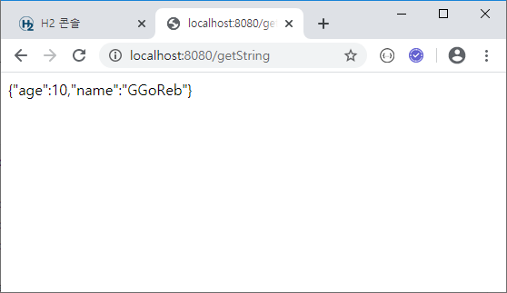


#### b. getForObject / Map

```java
@GetMapping("/getMap")
public Map<String, Object> getMap() {
    RestTemplate rt = new RestTemplate();
    Map<String, Object> map = rt.getForObject("http://ggoreb.com/http/json1.jsp", Map.class);
    return map;
}
```

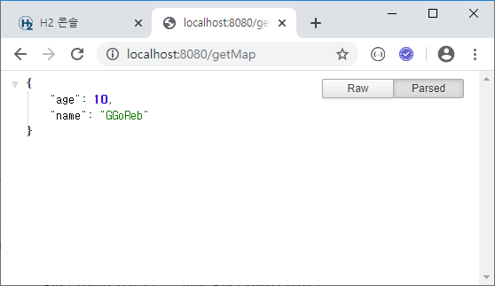


#### c. getForObject / List\<Map\>

```java
@GetMapping("/getListMap")
public List<Map<String, Object>> getListMap() {
    RestTemplate rt = new RestTemplate();
    List<Map<String, Object>> list = rt.getForObject("http://ggoreb.com/http/json2.jsp", List.class);
    return list;
}
```

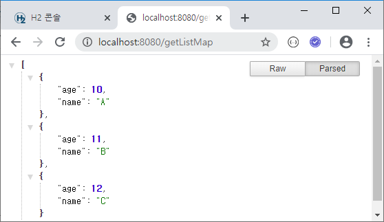


####  d. getForObject / List\<Object\>

**가장 권장하는 방법**

```java
@GetMapping("/getListObject")
public List<JsonData> getListObject() {
    RestTemplate rt = new RestTemplate();
    List<JsonData> list = rt.getForObject("http://ggoreb.com/http/json2.jsp", List.class);
    return list;
}
```

> model/JsonData.java

```java
package com.yonghyun.basic.model;

import lombok.Data;

@Data
public class JsonData {
	private int age;
	private String name;
}
```

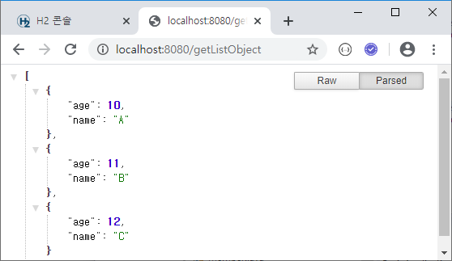


#### e-1. exchange / Kakao Map API 1

```java
@GetMapping("/getKakao")
public ResponseEntity<Map> getKakao() {
    RestTemplate rt = new RestTemplate();
    RequestEntity requestEntity = null;
    try {
        requestEntity = RequestEntity
            .get(new URI("https://dapi.kakao.com/v2/local/search/address.json?query="
                         + URLEncoder.encode("부산 연 제구 연산동 1000", "utf-8")))
            .header("Authorization", "KakaoAK xxxxxxxxxxxxxxxxxxxxxxxxxxxxxxxx").build();
    } catch (UnsupportedEncodingException e) {
        e.printStackTrace();
    } catch (URISyntaxException e) {
        e.printStackTrace();
    }
    ResponseEntity<Map> entity = rt.exchange(requestEntity, Map.class);
    return entity;
}
```

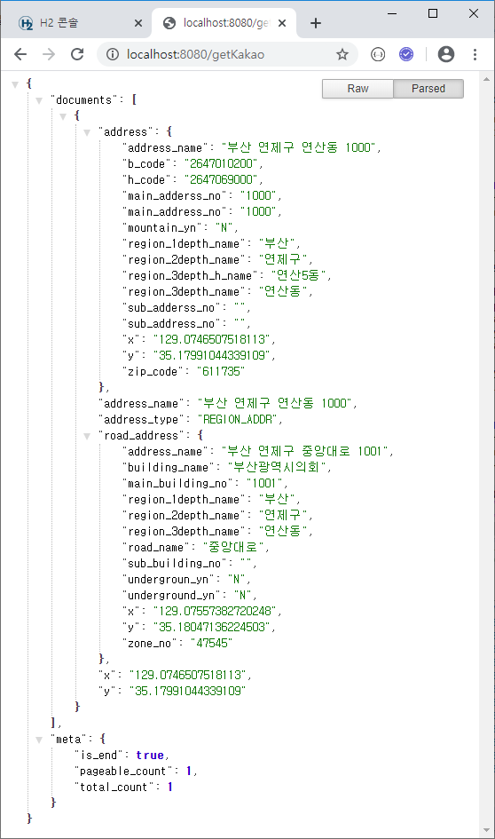


#### e-2. exchange / Kakao Map API 2

> getKakaoService.html 생성 (사용자 입력을 받기위한 html)

```html
<input type="text" id="address">
<button>위도/경도 변환</button>
<hr>
<!-- 자바스크립트 (jQuery AJAX 활용 -->
<script src="http://code.jquery.com/jquery-3.1.1.min.js"></script>

<!-- getKakao 주소를 호출 -->
<!-- parsing 후 롸면에 출력 -->
<script>
	$('button').click(function(){
		$.ajax({
			url : '/getKakao2',
			type : 'get',
			data : { 'address' : $('#address').val() },
			success : function(res) {
				console.log(res);
			}
		})
	});
</script>
```

> ServiceController (getKakaoService.html을 위한 컨트롤러)

```java
package com.yonghyun.basic.controller;

import org.springframework.stereotype.Controller;
import org.springframework.web.bind.annotation.GetMapping;

@Controller
public class ServiceController {
	@GetMapping("/getKakaoService")
	public String getKakaoService() {
		return "getKakaoService";
	}
}
```

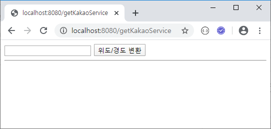

> RestTemplateController.java

```java
@GetMapping("/getKakao2")
public ResponseEntity<Map> getKakaoService(
    @RequestParam("address") String address) {
    RestTemplate rt = new RestTemplate();
    RequestEntity requestEntity = null;
    try {
        requestEntity = RequestEntity
            .get(new URI("https://dapi.kakao.com/v2/local/search/address.json?query="
                         + URLEncoder.encode(address, "utf-8")))
            .header("Authorization", "KakaoAK xxxxxxxxxxxxxxxxxxxxxxxxxxxxxxxx").build();
    } catch (UnsupportedEncodingException e) {
        e.printStackTrace();
    } catch (URISyntaxException e) {
        e.printStackTrace();
    }
    ResponseEntity<Map> entity = rt.exchange(requestEntity, Map.class);
    return entity;
}
```

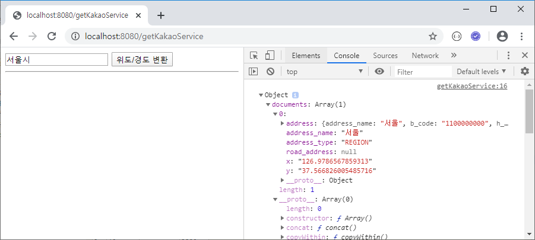


#### f-1. exchange / Naver Papago API 1

```java
@GetMapping("/getNaver")
public ResponseEntity<Map> getNaver() {
    RestTemplate rt = new RestTemplate();
    RequestEntity<Map<String, String>> requestEntity = null;
    try {
        Map<String, String> body = new HashMap<>();
        body.put("source", "ko");
        body.put("target", "en");
        body.put("text", "안녕하세요. 저는 자바 개발자입 니다.");
        requestEntity = RequestEntity.post(new URI("https://openapi.naver.com/v1/papago/n2mt"))
            .header("X-Naver-Client-Id", "xxxxxxxxxxxxxxxxxxxx").header("X-Naver-Client-Secret", "xxxxxxxxxx")
            .body(body);
    } catch (URISyntaxException e) {
        e.printStackTrace();
    }
    ResponseEntity<Map> entity = rt.exchange(requestEntity, Map.class);
    return entity;
}
```

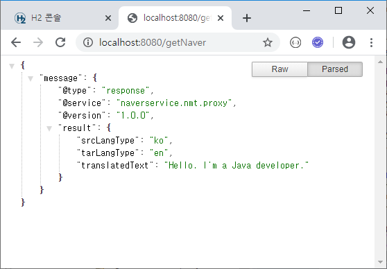


#### f-2. exchange / Naver Papago API 2-1

>  getNaverService.html 생성 (사용자 입력을 받기위한 html)

```html
<input type="text" id="transStr">
<button>번역</button>
<hr>
<!-- 자바스크립트 (jQuery AJAX 활용 -->
<script src="http://code.jquery.com/jquery-3.1.1.min.js"></script>

<!-- getKakao 주소를 호출 -->
<!-- parsing 후 롸면에 출력 -->
<script>
	$('button').click(function(){
		$.ajax({
			url : '/getNaver2',
			type : 'get',
			data : { 'transStr' : $('#transStr').val() },
			success : function(res) {
				console.log(res);
			}
		})
	});
</script>
```

> ServiceController (getNaverService.html을 위한 컨트롤러)

```java
package com.yonghyun.basic.controller;

import org.springframework.stereotype.Controller;
import org.springframework.web.bind.annotation.GetMapping;

@Controller
public class ServiceController {
	
    ....
        
	@GetMapping("/getNaverService")
	public String getNaverService() {
		return "getNaverService";
	}
}
```

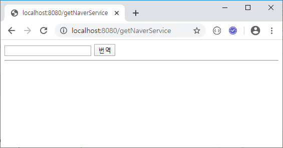

> RestTemplateController.java

```java
@GetMapping("/getNaver2")
public ResponseEntity<Map> getNaverService(
    @RequestParam("transStr") String transStr
) {
    RestTemplate rt = new RestTemplate();
    RequestEntity<Map<String, String>> requestEntity = null;
    try {
        Map<String, String> body = new HashMap<>();
        body.put("source", "ko");
        body.put("target", "en");
        body.put("text", transStr);
        requestEntity = RequestEntity.post(new URI("https://openapi.naver.com/v1/papago/n2mt"))
            .header("X-Naver-Client-Id", "xxxxxxxxxxxxxxxxxxxx").header("X-Naver-Client-Secret", "xxxxxxxxxx")
            .body(body);
    } catch (URISyntaxException e) {
        e.printStackTrace();
    }
    ResponseEntity<Map> entity = rt.exchange(requestEntity, Map.class);
    return entity;
}
```

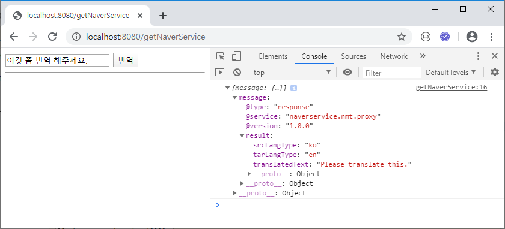


#### f-3. exchange / Naver Papago API 2-2

입력받은 html에 결과 출력하기

```html
<input type="text" id="transStr">
<button>번역</button>
<hr>
<!-- 자바스크립트 (jQuery) AJAX 활용 -->
<script src="http://code.jquery.com/jquery-3.1.1.min.js"></script>

<!-- getKakao 주소를 호출 -->
<!-- parsing 후 화면에 출력 -->
<script>
	$('button').click(function(){
		$.ajax({
			url : '/getNaver2',
			type : 'get',
			data : { 'transStr' : $('#transStr').val() },
			success : function(res) {
				console.log(res);
				var message = res.message;
				var result = message.result;
				var translatedText = result.translatedText;
				var html = '<h1>' + translatedText + '</h1>';
				$('hr').after(html);
			}
		})
	});
</script>
```

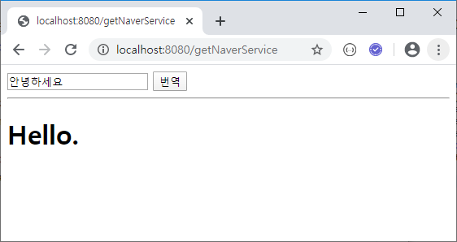


