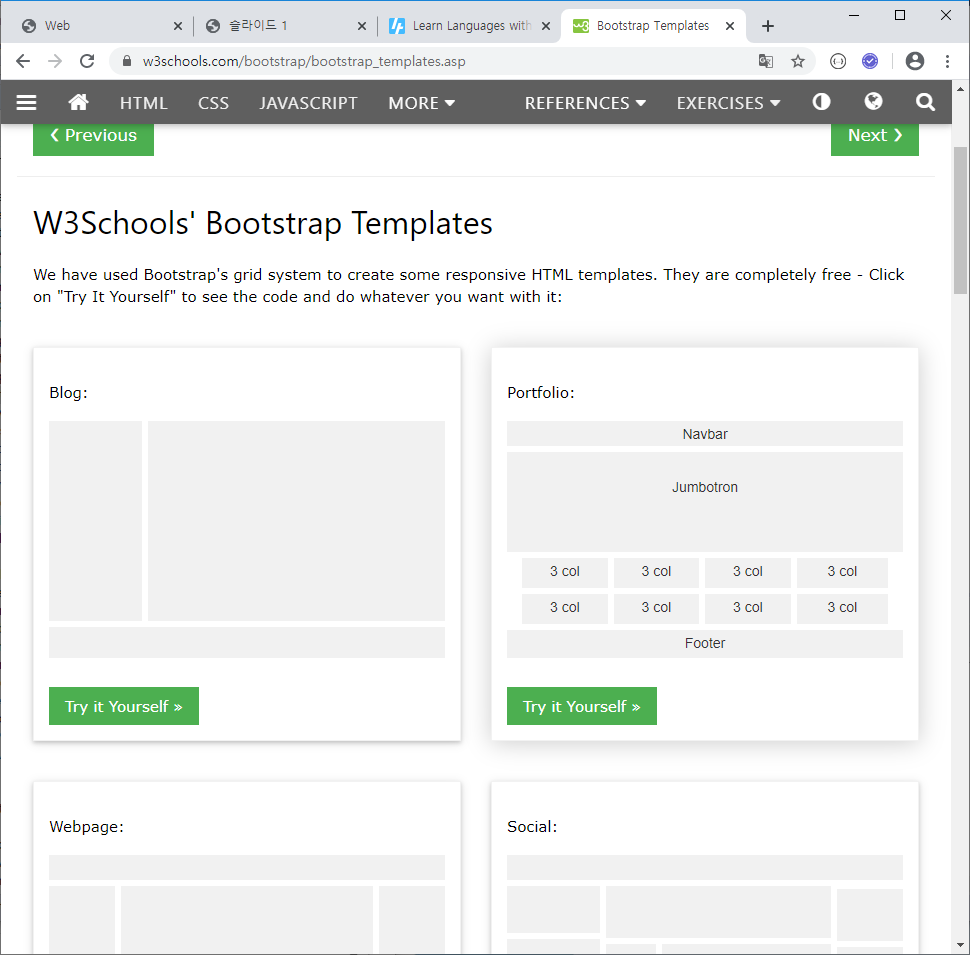
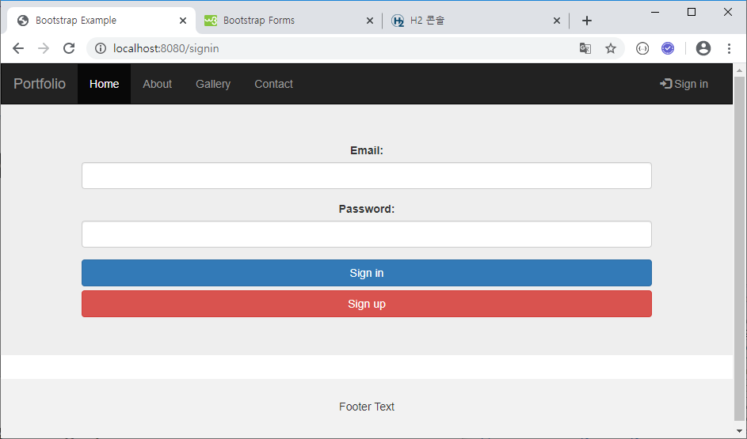

# JPA

### 1. New project


### 2. Bootstrap Templates 복사 (Portfolio)



templates/index.html 생성 및 복사 붙여넣기


### 3. HomeController

#### controller/HomeController.java 생성

```java
package com.yonghyun.board.controller;

import org.springframework.stereotype.Controller;
import org.springframework.web.bind.annotation.GetMapping;

@Controller
public class HomeController {
	@GetMapping({ "/", "/home" })
	public String index() {
		return "index";
	}
}
```


### 4. Template 공통 레이아웃 분리

페이지 수가 늘어나도 공통요소는 쉽게 유지보수 할 수 있도록..

index.html의 head, nav, footer를 templates/common 폴더 밑으로 옮김


### 5. Signup 구현

#### a. templates/signup.html 생성

```html
<!DOCTYPE html>
<html lang="en" xmlns:th="http://www.thymeleaf.org">
<head th:replace="common/head">
</head>
<body>

	<nav th:replace="common/nav"></nav>

	<div class="jumbotron">
		<div class="container text-center">
			<form method="post" action="/signup">
				<div class="form-group">
					<label for="email">Email:</label> <input type="text"
						class="form-control" id="email" name="email">
				</div>
				<div class="form-group">
					<label for="pwd">Password:</label> <input type="password"
						class="form-control" id="pwd" name="pwd">
				</div>
				<div class="form-group">
					<label for="name">Name:</label> <input type="text"
						class="form-control" id="name" name="name">
				</div>
				<button class="btn btn-primary btn-block" id="signup">Sign
					Up</button>
			</form>
		</div>
	</div>

	<footer th:replace="common/footer"> </footer>

	<script>
		$("#signup").click(function() {
			$("form").submit();
			return false;
		});
	</script>
</body>
</html>

```

#### b. controller/UserController.java 에 내용 추가

```java
@GetMapping({ "/signup" })
public String signup() {
    return "signup";
}
```


> 프로젝트 새로 만들고 `H2.bat` 을 `Embedded` 로 **최초 실행**해야 DB가 생김
>
> 


다시 server 로 연결하고 **application.properties** 에 수정된 url 추가

```java
spring.datasource.url=jdbc:h2:tcp://localhost/~/board
```


#### c. model/User.java 추가

```java
package com.yonghyun.board.model;

import javax.persistence.Entity;
import javax.persistence.GeneratedValue;
import javax.persistence.GenerationType;
import javax.persistence.Id;
import lombok.Data;

@Entity
@Data
public class User {
	@Id
	@GeneratedValue(strategy = GenerationType.AUTO)
	private long id;
	private String email;
	private String pwd;
	private String name;
}
```


#### d. repository/UserRepository.java 추가

```java
package com.yonghyun.board.repository;

import org.springframework.data.jpa.repository.JpaRepository;
import com.yonghyun.board.model.User;

public interface UserRepository extends JpaRepository<User, Long> {
}
```


#### e. controller/UserController.java 추가

```java
package com.yonghyun.board.controller;

import org.springframework.beans.factory.annotation.Autowired;
import org.springframework.stereotype.Controller;
import org.springframework.web.bind.annotation.GetMapping;
import org.springframework.web.bind.annotation.ModelAttribute;
import org.springframework.web.bind.annotation.PostMapping;
import com.yonghyun.board.model.User;
import com.yonghyun.board.repository.UserRepository;

@Controller
public class UserController {
	@Autowired
	UserRepository userRepository;

	@GetMapping("/signup")
	public String signup() {
		return "signup";
	}

	@PostMapping("/signup")
	public String signupPost(@ModelAttribute User user) {
		userRepository.save(user);
		return "redirect:/";
	}
}
```


#### f. signup 실행 및 DB 확인


### 6-1. signin

#### a. templates/signin.html 추가

```html
<!DOCTYPE html>
<html lang="en" xmlns:th="http://www.thymeleaf.org">
<head th:replace="common/head">
</head>
<body>

	<nav th:replace="common/nav"></nav>

	<div class="jumbotron">
		<div class="container text-center">
			<form method="post" action="/signin">
				<div class="form-group">
					<label for="email">Email:</label> <input type="text"
						class="form-control" id="email" name="email">
				</div>
				<div class="form-group">
					<label for="pwd">Password:</label> <input type="password"
						class="form-control" id="pwd" name="pwd">
				</div>
				<button class="btn btn-primary btn-block" id="signin">Sign
					in</button>
			</form>
		</div>
	</div>

	<footer th:replace="common/footer"> </footer>

	<script>
		$("#signin").click(function() {
			$("form").submit();
			return false;
		});
	</script>
</body>
</html>
```


#### b. repository/UserRepository.java 내용 추가

```java
public interface UserRepository extends JpaRepository<User, Long> {
	public User findByEmailAndPwd(String email, String pwd);
}
```


#### c. controller/UserController.java 내용 추가

```java
@Autowired
HttpSession session;

@GetMapping("/signin")
public String signin() {
    return "signin";
}

@PostMapping("/signin")
public String signinPost(@ModelAttribute User user) {
    User dbUser = userRepository.findByEmailAndPwd(user.getEmail(), user.getPwd());
    if (dbUser != null) {
        session.setAttribute("user_info", dbUser);
    }
    return "redirect:/";
}
```


### 6-2. signin 상태표시

#### nav.html 수정

```html
<nav class="navbar navbar-inverse">
	<div class="container-fluid">
		<div class="navbar-header">
			<button type="button" class="navbar-toggle" data-toggle="collapse"
				data-target="#myNavbar">
				<span class="icon-bar"></span> <span class="icon-bar"></span> <span
					class="icon-bar"></span>
			</button>
			<a class="navbar-brand" href="#">Portfolio</a>
		</div>
		<div class="collapse navbar-collapse" id="myNavbar">
			<ul class="nav navbar-nav">
				<li class="active"><a href="#">Home</a></li>
				<li><a href="#">About</a></li>
				<li><a href="#">Gallery</a></li>
				<li><a href="#">Contact</a></li>
			</ul>
			<ul class="nav navbar-nav navbar-right">
				<li th:if="${session.user_info} == null"><a href="/signin">
						<span class="glyphicon glyphicon-log-in"></span> Sign in
				</a></li>
				<li th:if="${session.user_info} != null"><a href="/signout">
						<span class="glyphicon glyphicon-log-out"></span> Sign out
						[[${session.user_info.name} + '님 반갑습니다.']]
				</a></li>
			</ul>
		</div>
	</div>
</nav>
```


### 7. signout

#### controller/UserController.java 내용 추가

```java
@GetMapping("/signout")
public String signout() {
    session.invalidate();
    return "redirect:/";
}
```


### 8. signin 에 signup 버튼 추가

#### signin.html에 내용 추가

```html
<div class="jumbotron">
    <div class="container text-center">
        <form method="post" action="/signin">
            
            ...
            
            <button class="btn btn-danger btn-block" id="signup">Sign
                up</button>
        </form>
    </div>
</div>

...

<script>
    ...
    
    $("#signup").click(function() {
        location = "/signup";
        return false;
    });
</script>
```




