#### application.properties

spring.jpa.hibernate.ddl-auto=[옵션]

update - 수정 사항이 있을 때만 재적용

create - 프로젝트 실행 될때마다 DB 초기화


#### CRUD

기본적인 데이터 처리 기능인 **Create**(생성), **Read**(읽기), **Update**(갱신), **Delete**(삭제)를 묶어서 일컫는 말이다. 사용자 인터페이스가 갖추어야 할 기능(정보의 참조/검색/갱신)을 가리키는 용어로서도 사용된다.


## 게시판

### 게시판 추가

#### 1. templates/board/write.html 생성

```html
<!DOCTYPE html>
<html lang="en" xmlns:th="http://www.thymeleaf.org">
<head th:replace="common/head">
</head>
<body>

	<nav th:replace="common/nav"></nav>

	<div class="jumbotron">
		<div class="container text-center">
			<form method="post" action="/board/write">
				<div class="form-group">
					<label for="title">Title:</label> <input type="text"
						class="form-control" name="title" id="title">
				</div>
				<div class="form-group">
					<label for="content">Content:</label>
					<textarea class="form-control" rows="5" name="content" id="content">
 </textarea>
				</div>
				<button type="button" id="complete"
					class="btn btn-primary btn-block">글쓰기</button>
			</form>
		</div>
	</div>


	<footer th:replace="common/footer"> </footer>

	<script>
		$("#complete").click(function() {
			$("form").submit();
			return false;
		});
	</script>
</body>
</html>
```

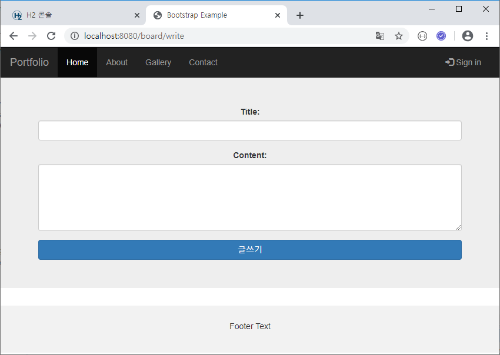


#### 2-1. model/Board.java 생성

```java
package com.yonghyun.board.model;

import javax.persistence.Entity;
import javax.persistence.GeneratedValue;
import javax.persistence.GenerationType;
import javax.persistence.Id;
import lombok.Data;

@Entity
@Data
public class Board {
	@Id
	@GeneratedValue(strategy = GenerationType.AUTO)
	private long id;
	private String title;
	private String content;
	private String userId;
}
```


#### 2-2. repository/BoardRepository.java 생성

```java
package com.yonghyun.board.repository;

import org.springframework.data.jpa.repository.JpaRepository;
import com.yonghyun.board.model.Board;

public interface BoardRepository extends JpaRepository<Board, Long> {
}
```


#### 3. controller/BoardController.java 생성

```java
package com.yonghyun.board.controller;

import javax.servlet.http.HttpSession;

import org.springframework.beans.factory.annotation.Autowired;
import org.springframework.stereotype.Controller;
import org.springframework.web.bind.annotation.GetMapping;
import org.springframework.web.bind.annotation.ModelAttribute;
import org.springframework.web.bind.annotation.PostMapping;

import com.yonghyun.board.model.Board;
import com.yonghyun.board.model.User;
import com.yonghyun.board.repository.BoardRepository;

@Controller
public class BoardController {
	@Autowired
	BoardRepository boardRepository;
	@Autowired
	HttpSession session;

	@GetMapping("/board/write")
	public String boardWrite() {
		return "board/write";
	}

	@PostMapping("/board/write")
	public String boardWritePost(@ModelAttribute Board board) {
		User user = (User) session.getAttribute("user_info");
		String userId = user.getEmail();
		board.setUserId(userId);
		boardRepository.save(board);
		return "board/write";
	}
}
```


### 글쓰기

지금 상태에서 글 쓰면

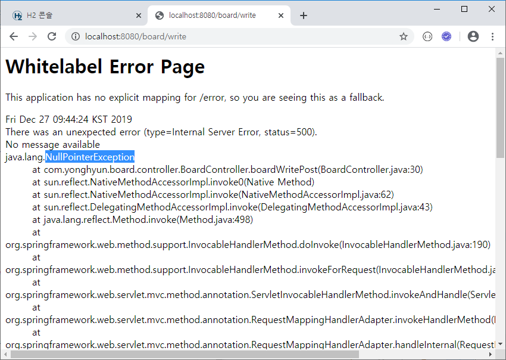

NullPointerException

at com.yonghyun.board.controller.BoardController.boardWritePost(BoardController.java:30)

code -> String userId = user.getEmail();

로그인을 하지 않았기 때문


로그인하고 다시 글쓰면 H2에 추가된 DB 확인 가능


> Index 자동 증가 이상을 수정하기위해 application.properties 에 옵션 추가
>
> \# auto increment spring.jpa.hibernate.use-new-id-generator-mappings=false
>
> DB 초기화를 위해 
>
> spring.jpa.hibernate.ddl-auto=create 로 했다가 update 로 변경
>
> 다시 signup and 글쓰기 하고 DB의 Index 확인
>
> 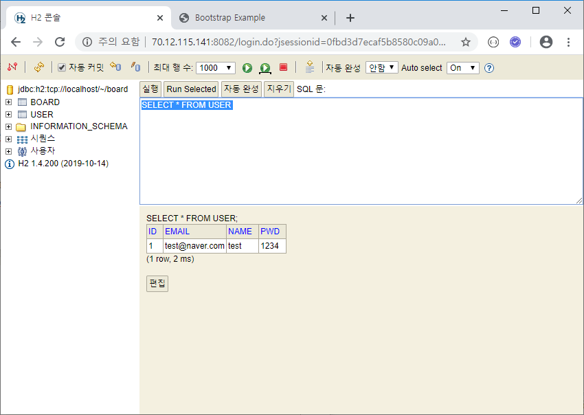
>
> 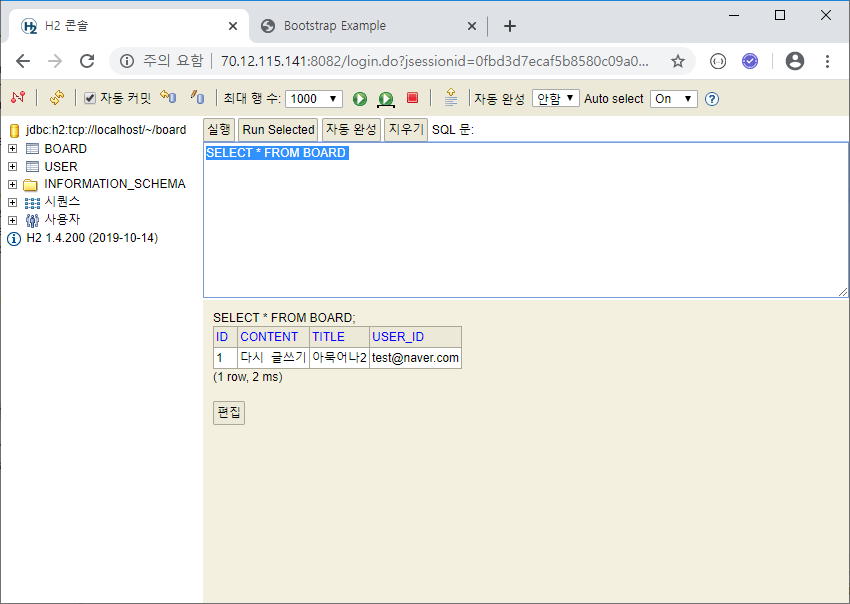


### 게시물 조회

#### 1. templates/board/list.html 생성

```html
<!DOCTYPE html>
<html lang="en" xmlns:th="http://www.thymeleaf.org">
<head th:replace="common/head">
</head>
<body>

	<nav th:replace="common/nav"></nav>

	<div class="jumbotron">
		<div class="container text-center">
			<table class="table table-hover">
				<thead>
					<tr>
						<th>번호</th>
						<th>제목</th>
						<th>작성자</th>
					</tr>
				</thead>
				<tbody>
					<tr th:each="board : ${list}" th:attr="id=${board.id}">
						<td th:text="${board.id}"></td>
						<td th:text="${board.title}"></td>
						<td th:text="${board.userId}"></td>
					</tr>
				</tbody>
			</table>
			<button type="button" class="btn btn-primary btn-block" id="write">글쓰기</button>
		</div>
	</div>

	<footer th:replace="common/footer"> </footer>

	<script>
		$("#write").click(function() {
			location = "/board/write";
			return false;
		});
	</script>
</body>
</html>
```

#### 2. controller/BoardController.java 추가

```java
...
@GetMapping("/board")
public String board(Model model) {
    List<Board> list = boardRepository.findAll();
    model.addAttribute("list", list);
    return "board/list";
}
...
```

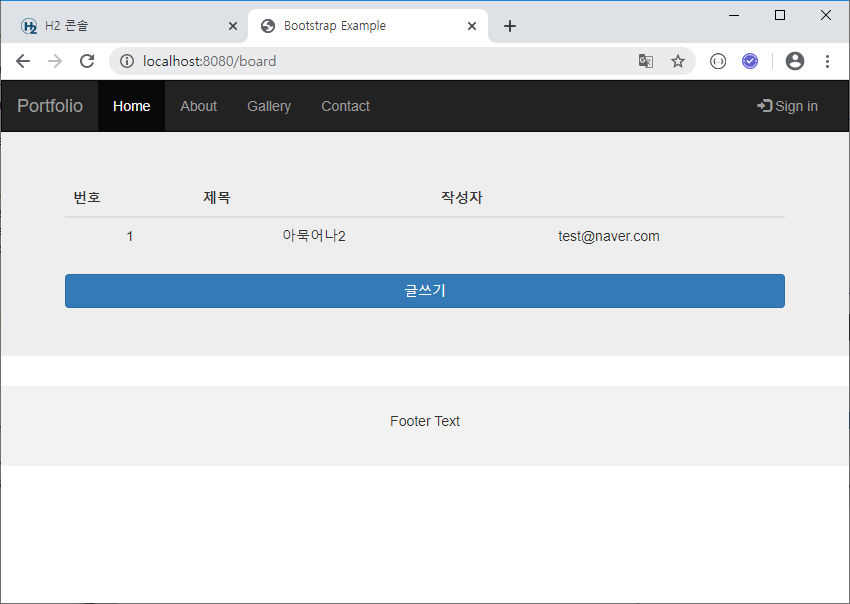

> 게시물 내림차순 정렬
>
> 위 BoardController의 ~.findAll(Sort.by(Sort.Direction.DESC, "id")) 로 수정
>
> ```java
> import org.springframework.data.domain.Sort;
> ```
>
> 
>
> 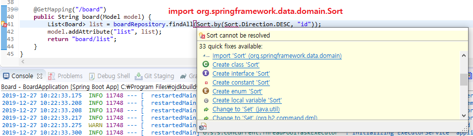
>
> 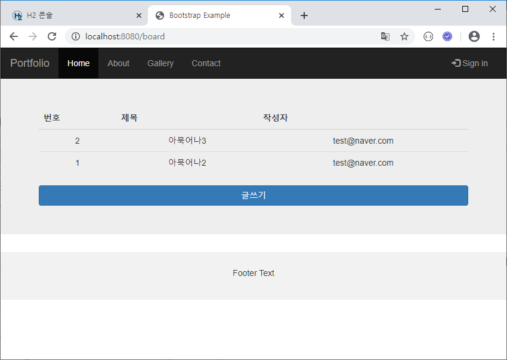


### 게시물 상세조회

#### 1. templates/board/list.html 스크립트 추가

```html
...
<script>
    ...
    $("tr").click(function() {
        var id = $(this).attr("id");
        location = "/board/" + id;
        return false;
    });
</script>
...
```

#### 2. templates/board/view.html 생성

```html
<!DOCTYPE html>
<html lang="en" xmlns:th="http://www.thymeleaf.org">
<head th:replace="common/head">
</head>
<body>

	<nav th:replace="common/nav"></nav>

	<div class="container">
		<div class="panel-group">
			<div class="panel panel-default">
				<div class="panel-heading" th:text="${board.id} + '번'"></div>
				<div class="panel-heading" th:text="${board.title}"></div>
				<div class="panel-body" th:text="${board.content}"></div>
				<div class="panel-footer" th:text="${board.userId}"></div>
			</div>
		</div>
	</div>
	<div class="container text-right">
		<button type="button" class="btn btn-default" id="list">목록</button>
		<button type="button" class="btn btn-default" id="update">수정</button>
		<button type="button" class="btn btn-default" id="delete">삭제</button>
	</div>

	<footer th:replace="common/footer"> </footer>

	<script>
	 $("#list").click(function() {
	 	location = "/board";
		return false;
	 });
	 	$("#update").click(function() {
	 	location = "/board/update/" + [[${board.id}]];
	 	return false;
	 });
	 $("#delete").click(function() {
	 	location = "/board/delete/" + [[${board.id}]];
	 	return false;
	 });
 	</script>
</body>
</html>
```

#### 3. controller/BoardController.java에 내용 추가

```java
@GetMapping("/board/{id}")
public String boardView(Model model, @PathVariable("id") long id) {
    Optional<Board> data = boardRepository.findById(id);
    Board board = data.get();
    model.addAttribute("board", board);
    return "board/view";
}
```


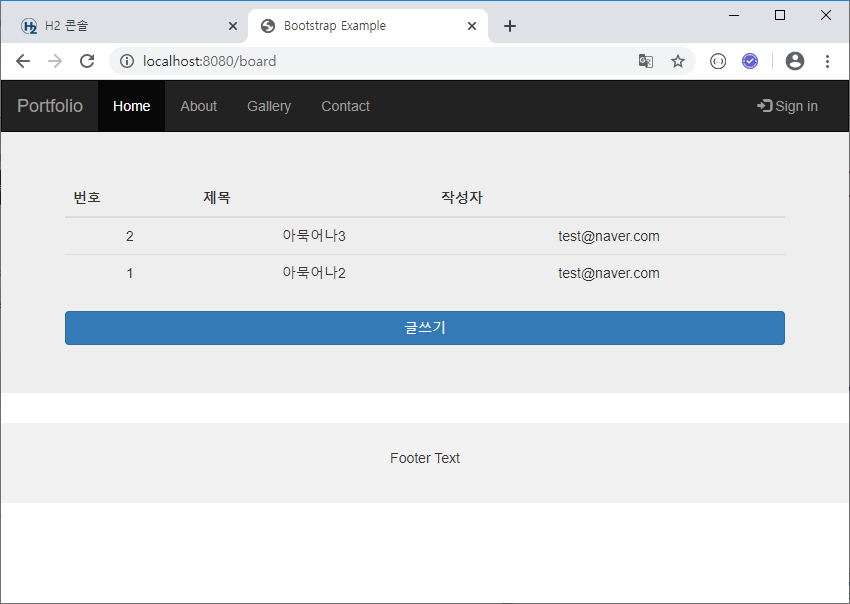

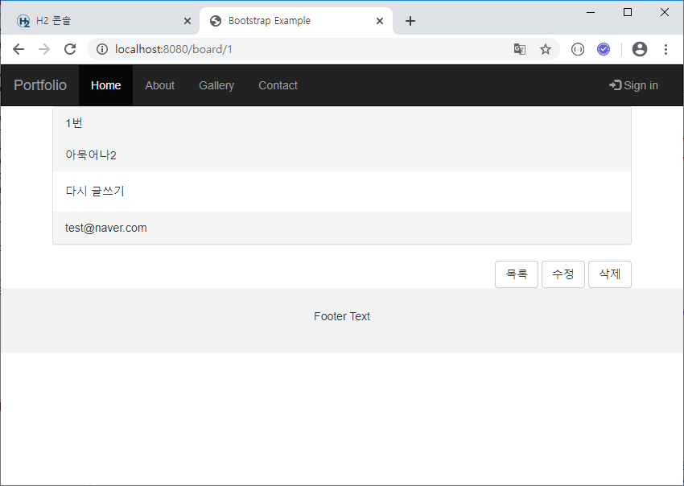


### 게시물 수정 및 삭제

#### 1. templates/board/update.html 추가

```html
<!DOCTYPE html>
<html lang="en" xmlns:th="http://www.thymeleaf.org">
<head th:replace="common/head">
</head>
<body>

	<nav th:replace="common/nav"></nav>

	<div class="jumbotron">
		<div class="container text-center">
			<form method="post" th:action="@{/board/update/} + ${board.id}">
				<div class="form-group">
					<label for="title">Title:</label> <input type="text"
						class="form-control" name="title" id="title"
						th:value="${board.title}">
				</div>
				<div class="form-group">
					<label for="content">Content:</label>
					<textarea class="form-control" rows="5" name="content" id="content">[[${board.content}]]</textarea>
				</div>
				<button type="button" id="complete"
					class="btn btn-primary btn-block">수정</button>
			</form>
		</div>
	</div>


	<footer th:replace="common/footer"> </footer>

	<script>
		$("#complete").click(function() {
			$("form").submit();
			return false;
		});
	</script>
</body>
</html>
```

#### 2. controller/BoardController.java에 수정 추가

```java
@GetMapping("/board/update/{id}")
public String boardUpdate(Model model, @PathVariable("id") long id) {
    Optional<Board> data = boardRepository.findById(id);
    Board board = data.get();
    model.addAttribute("board", board);
    return "board/update";
}

@PostMapping("/board/update/{id}")
public String boardUpdatePost(@ModelAttribute Board board, @PathVariable("id") long id) {
    User user = (User) session.getAttribute("user_info");
    String userId = user.getEmail();
    board.setUserId(userId);
    board.setId(id);
    boardRepository.save(board);
    return "redirect:/board/" + id;
}
```

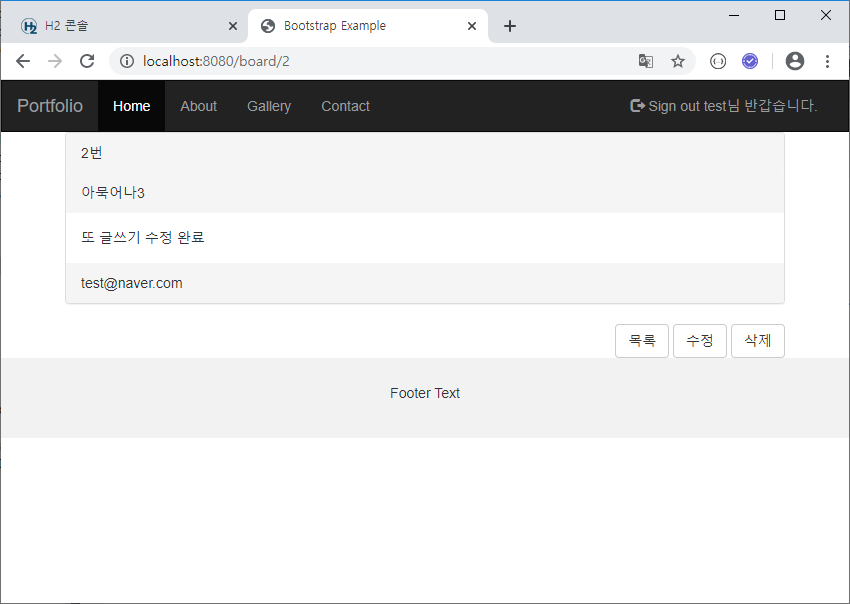

#### 3. controller/BoardController.java에 삭제 기능 추가

```java
@GetMapping("/board/delete/{id}")
public String boardDelete(@PathVariable("id") long id) {
    boardRepository.deleteById(id);
    return "redirect:/board";
}
```

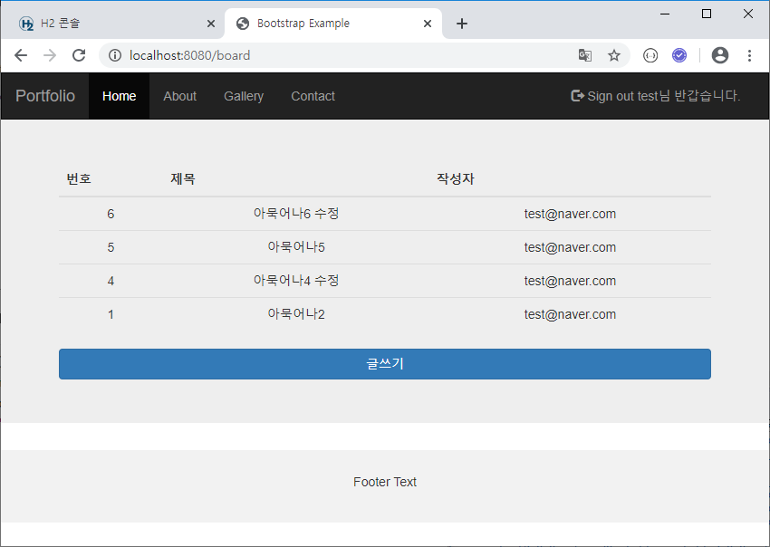

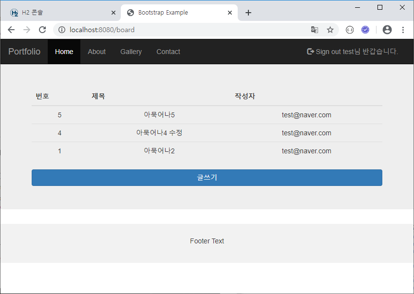

