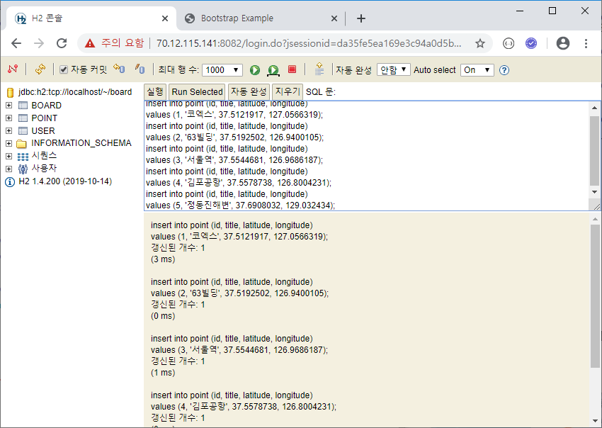
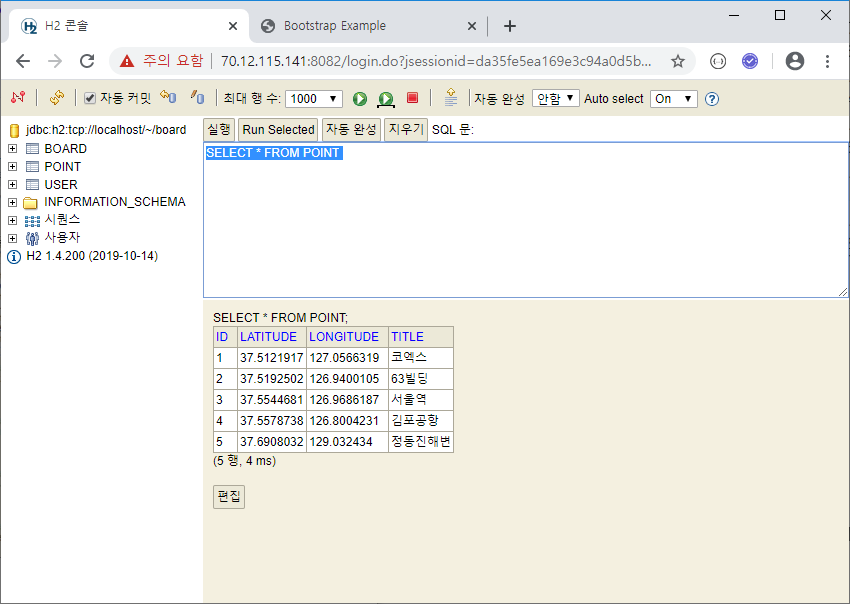
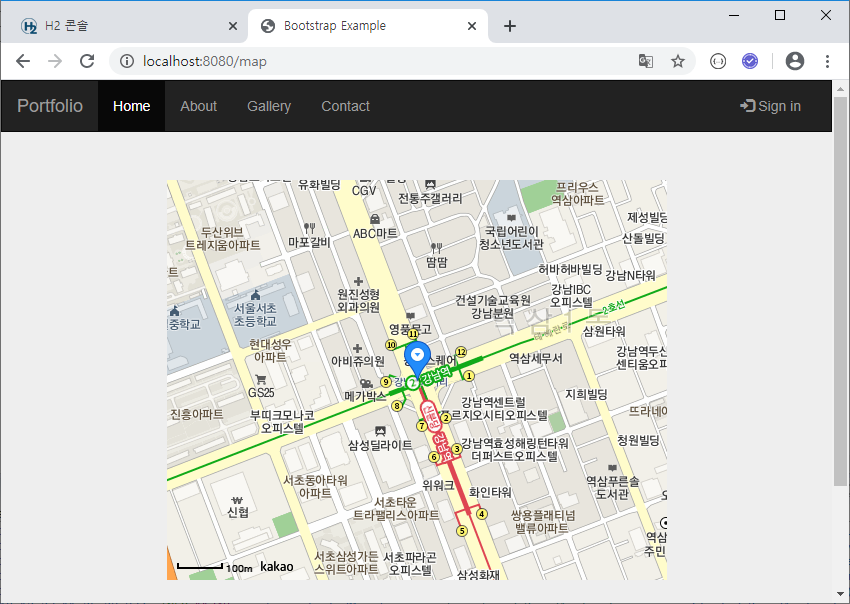
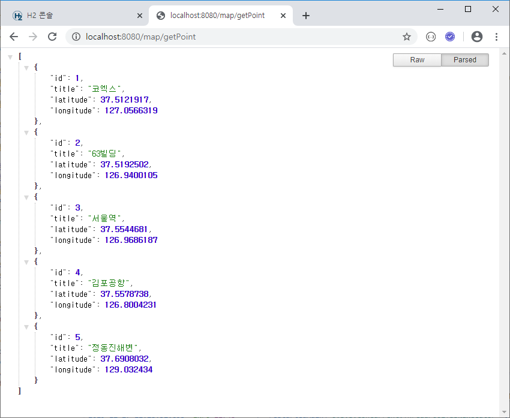
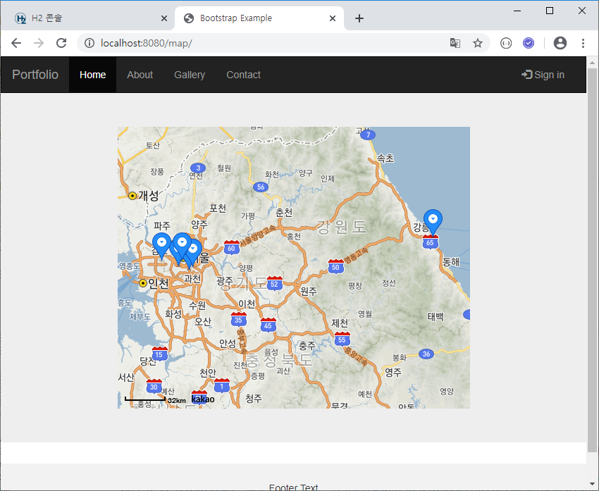
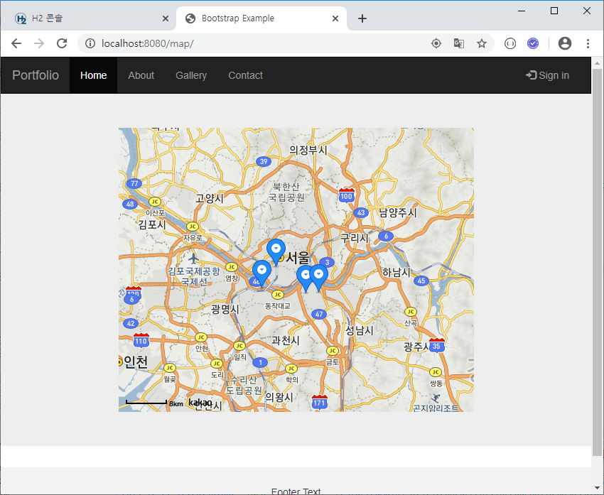
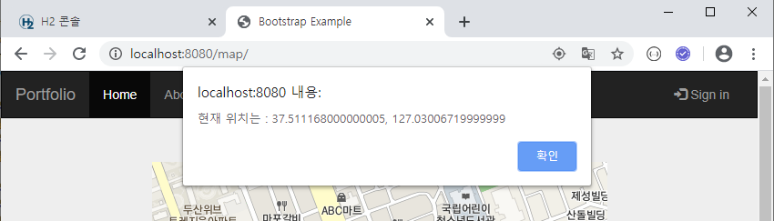
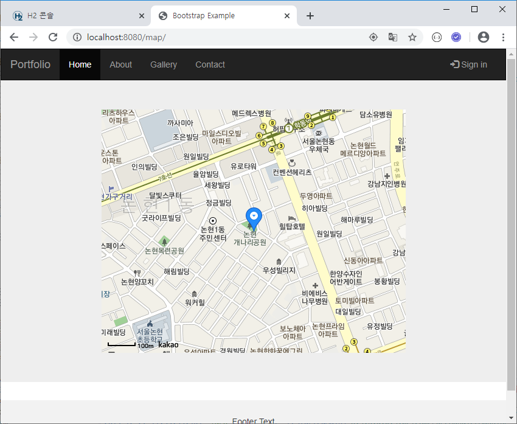

## 지도

### 주변 장소 DB등록

#### 1-1. model/Point.java 추가

```java
package com.yonghyun.board.model;

import javax.persistence.Entity;
import javax.persistence.GeneratedValue;
import javax.persistence.GenerationType;
import javax.persistence.Id;
import lombok.Data;

@Entity
@Data
public class Point {
	@Id
	@GeneratedValue(strategy = GenerationType.AUTO)
	private long id;
	private String title;
	private double latitude;
	private double longitude;
}
```

#### 1-2. repository/PointRepository.java 추가

```java
package com.yonghyun.board.repository;

import org.springframework.data.jpa.repository.JpaRepository;
import com.yonghyun.board.model.Point;

public interface PointRepository extends JpaRepository<Point, Long> {
}

```

#### 2. H2 Database 추가





### 지도 출력

#### 1. templates/map/map.html 생성

```html
<!DOCTYPE html>
<html lang="en" xmlns:th="http://www.thymeleaf.org">
<head th:replace="common/head">
</head>
<body>

	<nav th:replace="common/nav"></nav>

	<div class="jumbotron">
		<div class="container text-center">
			<div id="map" style="width: 500px; height: 400px; margin: 0 auto;"></div>
		</div>
	</div>

	<footer th:replace="common/footer"> </footer>

	<script
		src="http://dapi.kakao.com/v2/maps/sdk.js?appkey=[API_KEY]"></script>
	<script>
		var container = document.getElementById('map');
		var options = {
			center : new kakao.maps.LatLng(37.4980239, 127.027572), // 강남역
			level : 4
		};
		var map = new kakao.maps.Map(container, options);
		var markerPosition = new kakao.maps.LatLng(37.4980239, 127.027572);
		var marker = new kakao.maps.Marker({
			position : markerPosition
		});
		marker.setMap(map);
	</script>
</body>
</html>
```

#### 2. controller/MapController.java 생성

```java
package com.yonghyun.board.controller;

import org.springframework.stereotype.Controller;
import org.springframework.ui.Model;
import org.springframework.web.bind.annotation.GetMapping;

@Controller
public class MapController {
	@GetMapping("/map")
	public String map(Model model) {
		return "map/map";
	}
}
```




### 여러개 마커 표시

#### 1. controller/MapController.java 에 내용 추가

```java
@Autowired
PointRepository pointRepository;

@GetMapping("/map/getPoint")
@ResponseBody
public List<Point> getPoint() {
    List<Point> list = pointRepository.findAll();
    return list;
}
```



#### 2. templates/map/map.html 에 내용 추가

```java
<script>
    ...

$.ajax({
    url : '/map/getPoint',
    data : {},
    success : function(res) {
        for (var i = 0; i < res.length; i++) {
            var marker = new kakao.maps.Marker({
                map : map, // 마커를 표시할 지도
                position : new kakao.maps.LatLng(res[i].latitude,
                                                 res[i].longitude),
                title : res[i].title,
            });
        }
    }
});
</script>
```




### 반경 거리 기준 표시(10km 이내만 표시)

#### 1. controller/MapController.java 의 getPoint 수정

```java
@GetMapping("/map/getPoint")
@ResponseBody
public List<Point> getPoint(double lat, double lng) {
    List<Point> list = pointRepository.findAll();
    for (int i = list.size() - 1; i >= 0; i--) {
        double dist = distance(lat, lng, list.get(i).getLatitude(), list.get(i).getLongitude());
        if (dist > 10) {
            list.remove(i);
        }
    }
    return list;
}

...
    
private double distance(double lat1, double lon1, double lat2, double lon2) {
    double theta = lon1 - lon2;
    double dist = Math.sin(deg2rad(lat1)) * Math.sin(deg2rad(lat2))
        + Math.cos(deg2rad(lat1)) * Math.cos(deg2rad(lat2)) * Math.cos(deg2rad(theta));
    dist = Math.acos(dist);
    dist = rad2deg(dist);
    dist = dist * 60 * 1.1515;
    dist = dist * 1.609344;
    return dist;
}

private double deg2rad(double deg) {
    return deg * Math.PI / 180.0;
}

private double rad2deg(double rad) {
    return rad * 180 / Math.PI;
}
```

#### 2. templates/map/map.html

```html
<script>
var container = document.getElementById('map');
var options = {
center : new kakao.maps.LatLng(37.4980239, 127.027572), // 강남역
level : 4
};
var map = new kakao.maps.Map(container, options);
var markerPosition = new kakao.maps.LatLng(37.4980239, 127.027572);
var marker = new kakao.maps.Marker({
position : markerPosition
});
marker.setMap(map);

$.ajax({
	url : '/map/getPoint',
	data : {
		"lat" : 37.4980239,
		"lng" : 127.027572
	},
	success : function(res) {
		for (var i = 0; i < res.length; i++) {
			var marker = new kakao.maps.Marker({
								map : map, // 마커를 표시할 지도
								position : new kakao.maps.LatLng(res[i].latitude,
								res[i].longitude),
								title : res[i].title,
							});
		}
	}
});
</script>
```

dist 10km 이내 좌표만 출력되는 것을 확인




### 현재 위치 위도 경도

```html
<script>
    navigator.geolocation.getCurrentPosition(function(pos) {
        var latitude = pos.coords.latitude;
        var longitude = pos.coords.longitude;
        alert("현재 위치는 : " + latitude + ", "+ longitude);
    });
    ...
</script>
```






