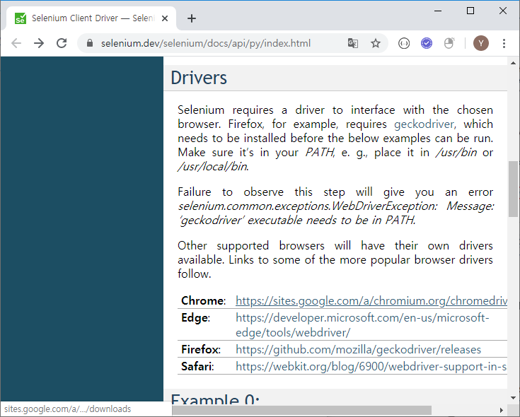
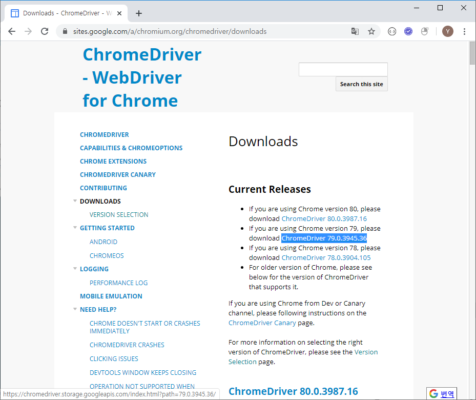
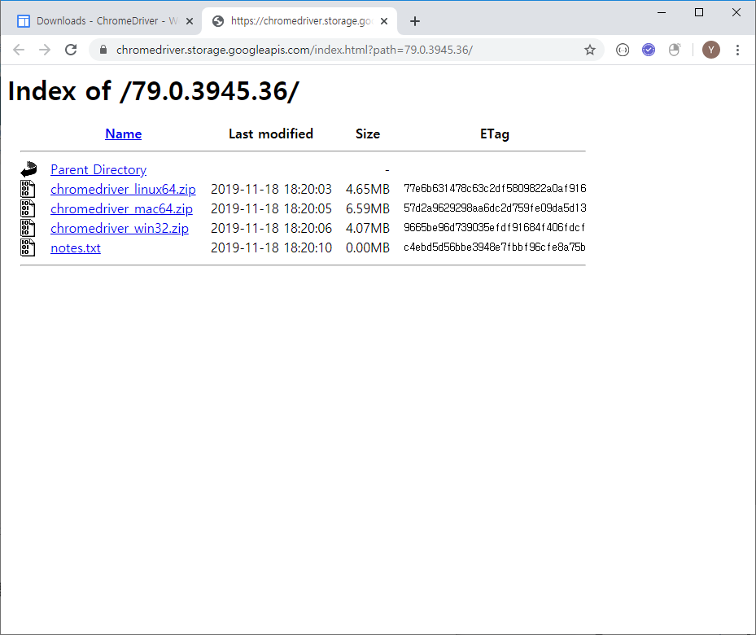
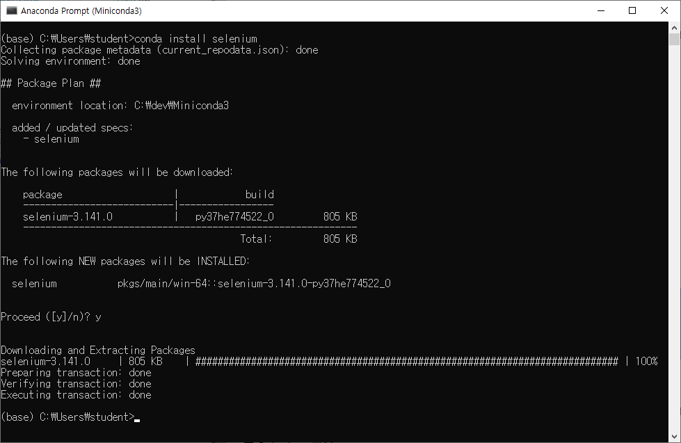
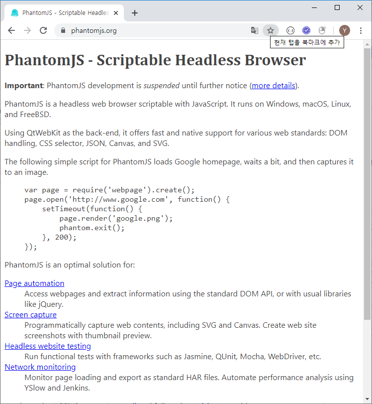
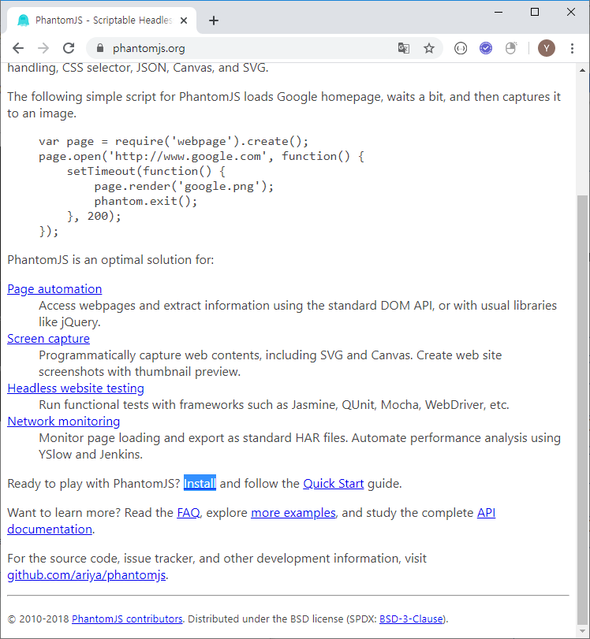

### Selenium

#### 1. 파이썬 라이브러리 셀레니움

#### 2. 사용할 브라우저의 드라이버

https://selenium.dev/selenium/docs/api/py/index.html

chromedriver.exe 파일을 쥬피터 파일과 같은 위치에 복사

Selenium 다운로드

### PhantomJS

[PhantomJS](https://phantomjs.org/)

phantomjs.exe 파일을 쥬피터 파일과 같은 위치에 복사

