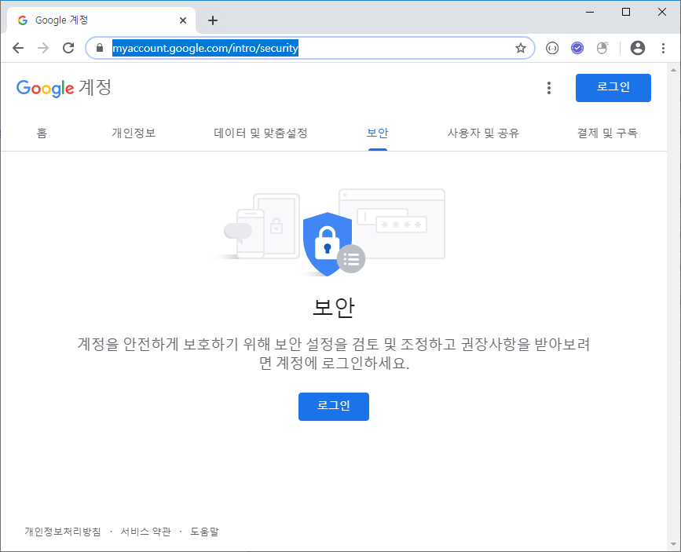
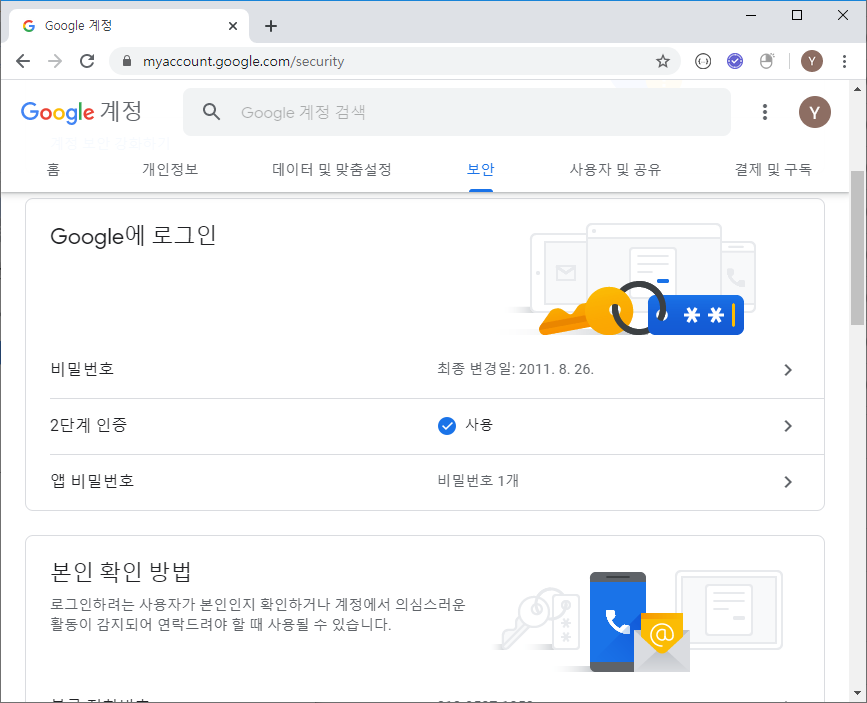
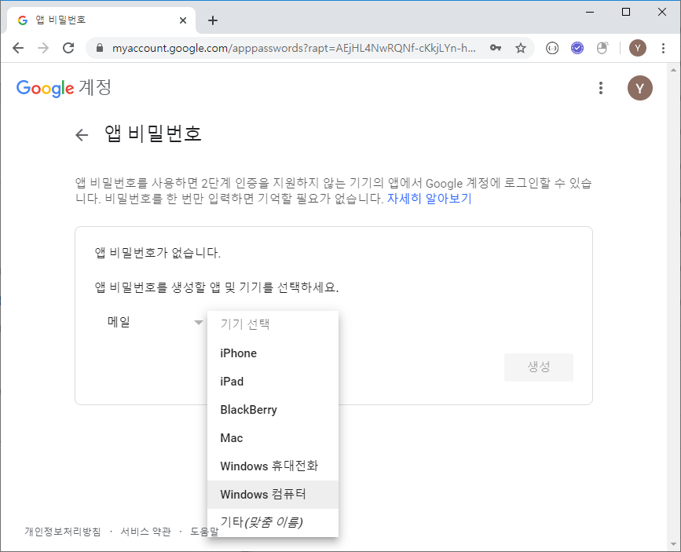
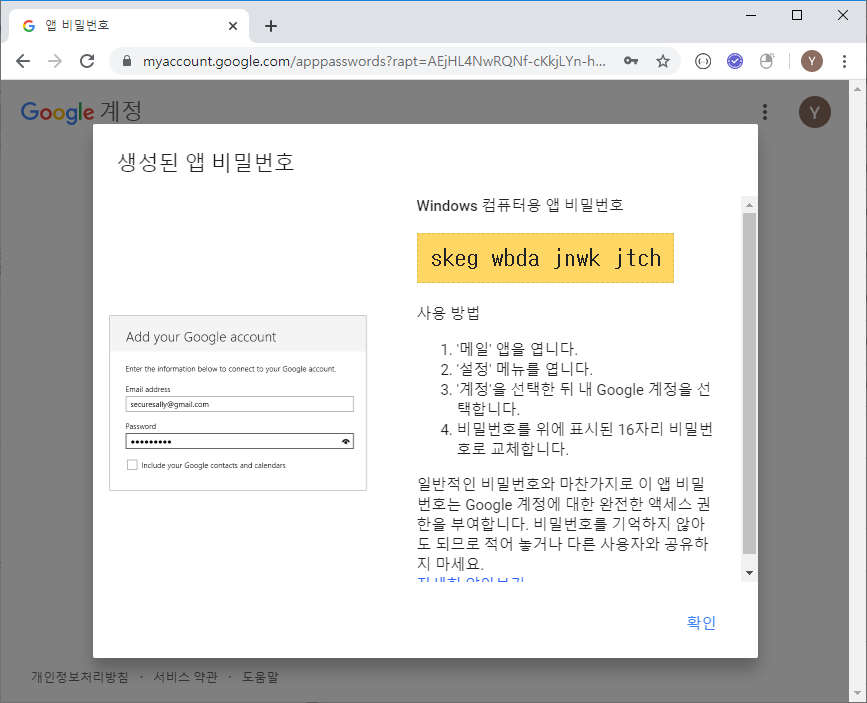

### 이메일 발송하기


https://myaccount.google.com/intro/security




2단계 인증 적용


앱비밀번호








재확인 불가 -> 까먹으면 재발급


```python
import smtplib
from email.mime.text import MIMEText

def sendMail(from_email, to_email, msg):
    smtp = smtplib.SMTP_SSL('smtp.gmail.com', 465)
    smtp.login(from_email, '[앱비밀번호]') 
    msg = MIMEText(msg)
    msg['Subject'] = '가입인사'
    msg['To'] = to_email
    smtp.sendmail(from_email, to_email, msg.as_string())
    smtp.quit()


sendMail('[보내는 사람(앱비밀번호 발급 메일)]', '[받을 사람]', '환영합니다.')
```

